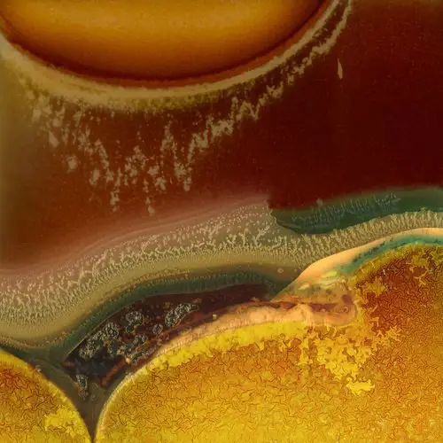

## Richard Earney

I’m a photographer who aims to represent the landscape using Abstract and Conceptual photography. I tend to work in series rather than the individual image.

Over the years the common themes of representing time and motion in the still image have become more central to my work.

## Books

[The Prismatic Pond](https://methodphotopress.co.uk), 2022

[Warped Topographies II](http://methodphotopress.uk/), 2020 (can also be viewed at [Biblioscapes](https://biblioscapes.com/library/warped-topographies-ii))

[Warped Topographies](https://www.kozubooks.com/books-new/richard-earney-warped-topographies), 2018 (can also be viewed at [Biblioscapes](https://biblioscapes.com/library/warped-topographies))

[Inside Lightroom 2: The serious photographer's guide to Lightroom efficiency](https://www.amazon.co.uk/Inside-Lightroom-serious-photographers-efficiency/dp/1138456306?crid=13UHN3DFGKZXT&keywords=Inside%20lightroom&qid=1666183854&sprefix=inside%20lightroom%2Caps%2C82&sr=8-1), 2012

## Awards/Positions

*Selector:* Stephen H. Tyng Collection 2018/19

Fellow of the Royal Photographic Society (FRPS) 2017

Associate of the Royal Photographic Society (ARPS) 2014

Licentiate of the Royal Photographic Society (LRPS) 2004

## Articles

[Royal Photographic Society Visual Art Magazine 157, Jan 2020](blog/2018-01-14-feature-in-the-rps-journal)

Endframe, On Landscape Magazine, Dec 2019

Featured Photographer, [On Landscape Magazine](https://www.onlandscape.co.uk/2019/12/cemetery-bins-graveyards-graveyard/), Oct 2018

Royal Photographic Society, [RPS Journal, Fellowship Special](https://method.photo/s/RPS-Journal-January-2018.pdf), Jan 2018

Royal Photographic Society Distinctions Panel, 2017

Pryme Magazine, [Happy Accidents](http://prymeeditions.com/happy-accidents-september-2017), 2017

On Landscape Magazine, [Warped Topographies](https://www.onlandscape.co.uk/2017/04/warped-topographies/), 2017

Inside the Outside, [Warped Topographies](http://www.inside-the-outside.com/warped-topographies-richard-earney/), 2017

On Landscape Magazine,  4x4, [Abstract Grasses](https://www.onlandscape.co.uk/2016/01/subscribers-4x4-portfolios-106/), 2016

On Landscape Magazine, [Hipstamatic Landscape Photography](https://www.onlandscape.co.uk/2011/11/hipstamatic-landscape-photography/), 2011

## Exhibitions

[London Independent Photography Crouch End group, 2023, The Original Gallery, London](blog/2023-03-21-lip-crouch-end-annual)

Jupiter Asset Mananagement

[London Independent Photography Crouch End group, 2022, The Original Gallery, London](blog/2022-03-15-crouch-end-lip-annual-show)

#Connected 2021

#Connected 2020: Re-Connected

[LIP Chronicles: Life Under Lockdown 2020](blog/2021-01-13-lip-chronicles-life-in-lockdown)

[London Photo Show 2019, Bargehouse Gallery, Oxo Tower](blog/2019-10-17-the-london-photo-show)

London Independent Photography Crouch End group, 2019, Ply Gallery, London

[London Independent Photography LIP 31 Exhibition 2019, Espacio Gallery (selected by Laura Noble, Tom Hunter, Philip Grey; curated by Colleen Rowe Harvey)](blog/2019-10-01-lip-31)

On Landscape, Meeting of Minds 2018 Community Exhibition

[London Independent Photography LIP 30 Exhibition 2018, Espacio Gallery](blog/2018-10-08-london-independent-photographers-30th-annual-exhibition)

[#Connected 2018, Patching’s Gallery, Nottinghamshire](blog/2018-04-25-#connected2018)

#ConnectedTen, Patching’s Gallery, Nottinghamshire

[RPS Biennial 2017, Shire Hall Gallery, Stafford, Hull International Photo Festival, Royal Albert Hall](blog/2017-02-14-rps-biennial-2017)

On Landscape, Meeting of Minds 2016 Community Exhibition

[International Photobook Exhibition 2016, Espacio Gallery, London](blog/2016-10-11-rps-international-photobook-exhibition)

## Talks

On Landscape, Meeting of Minds 2018, *Overcoming Creative Blocks*

RPS Southern Region 2018, *On Turning Away*

Magdelane College, Cambridge Festival of Sound, *The User Experience of Music Recognition*

## Podcasts

Biblioscapes: In Discussion [Episode 113](https://biblioscapes.com/in-discussion/richard-earney-1) (The Prismatic Pond)

Biblioscapes: In Discussion [Episode 3](https://biblioscapes.com/in-discussion/richard-earney) (Warped Topographies)

