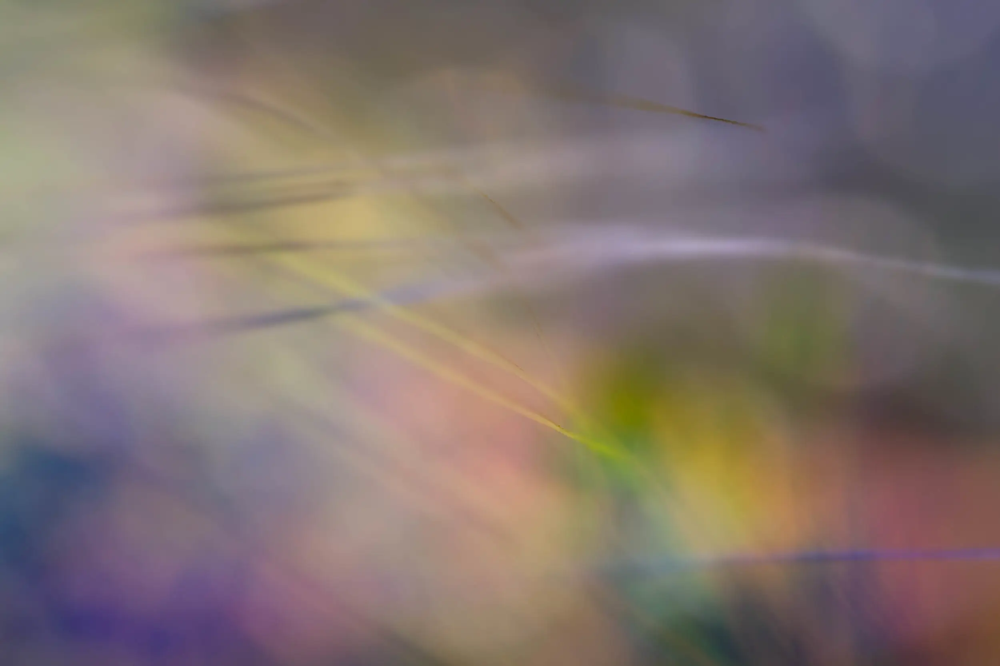

#### {{page.date}}

Last week's On Landscape Magazine published some of my [Abstract Grasses](../abstract-grasses) in its [Subscribers 4x4 section](https://www.onlandscape.co.uk/2016/01/subscribers-4x4-portfolios-106/).

Their 4x4 feature is a set of four mini portfolios from their subscribers, each consisting of four images related in some way.

I also loved Stuart Westmore's Roebuck Bay tides, abstract seascapes in the same section.

Aerial views such as these, and those shot by masters like [Hans Strand](http://www.hansstrand.se/), alter your perspective of the landscape more than almost any other part of the canon. Of course heading up in a plane is an expensive old business, but well worth it from the work we see.

