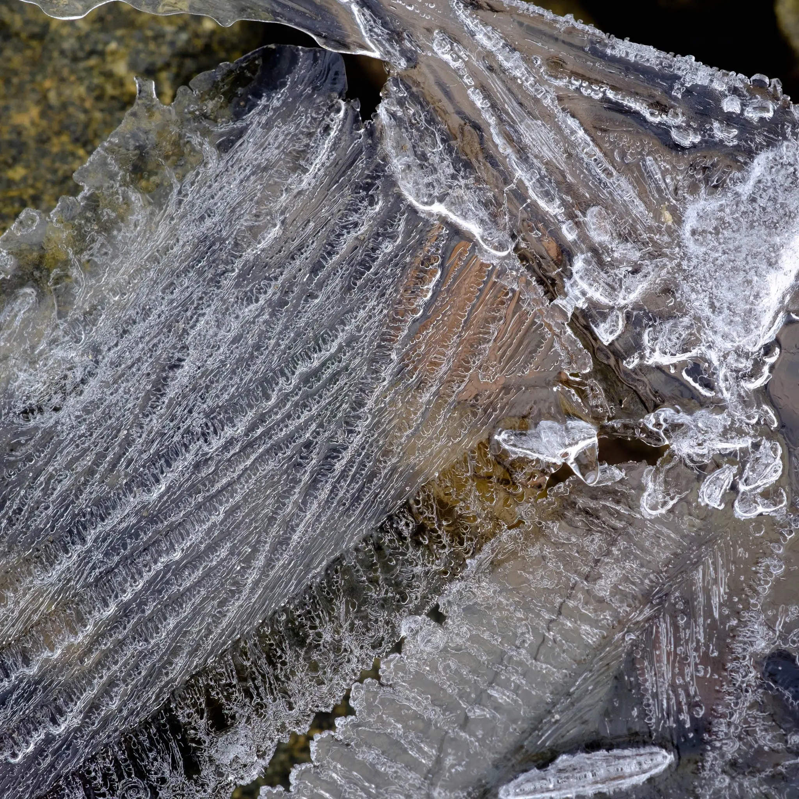
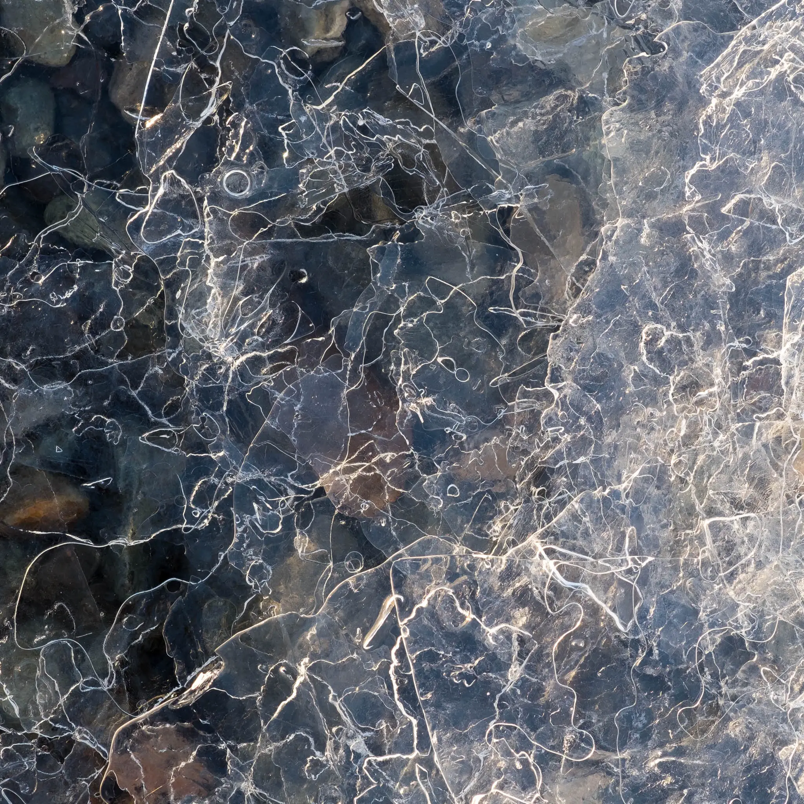
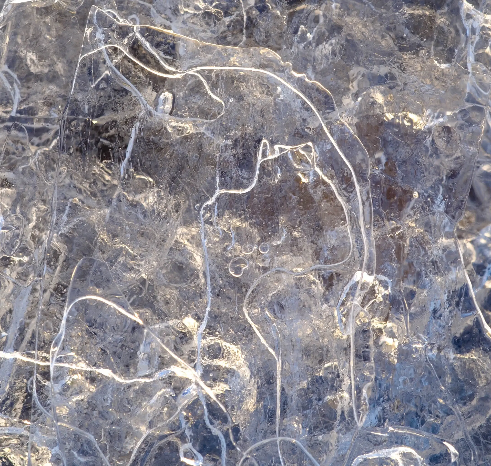
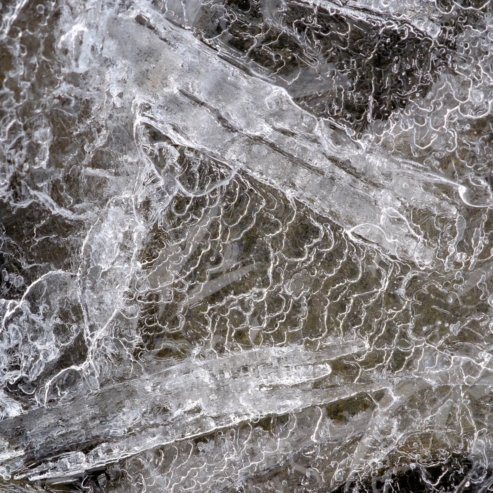
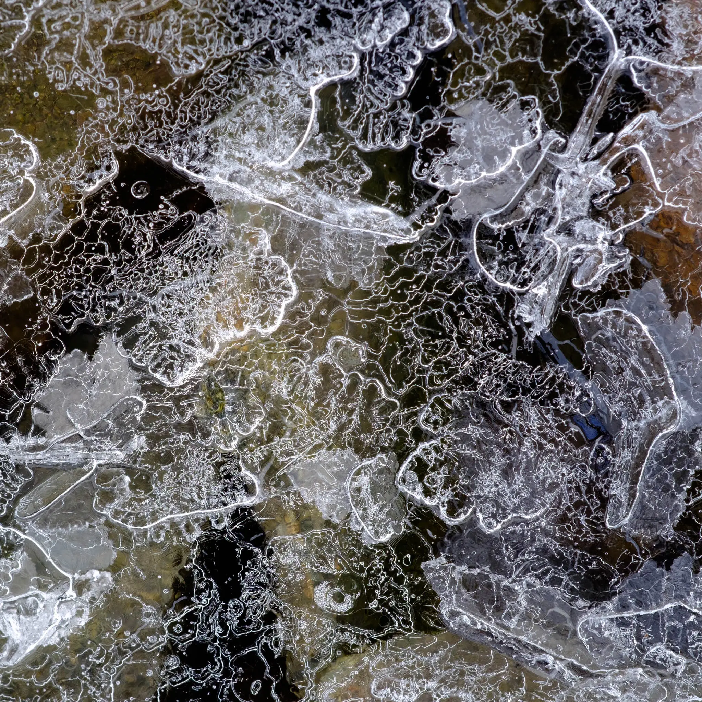
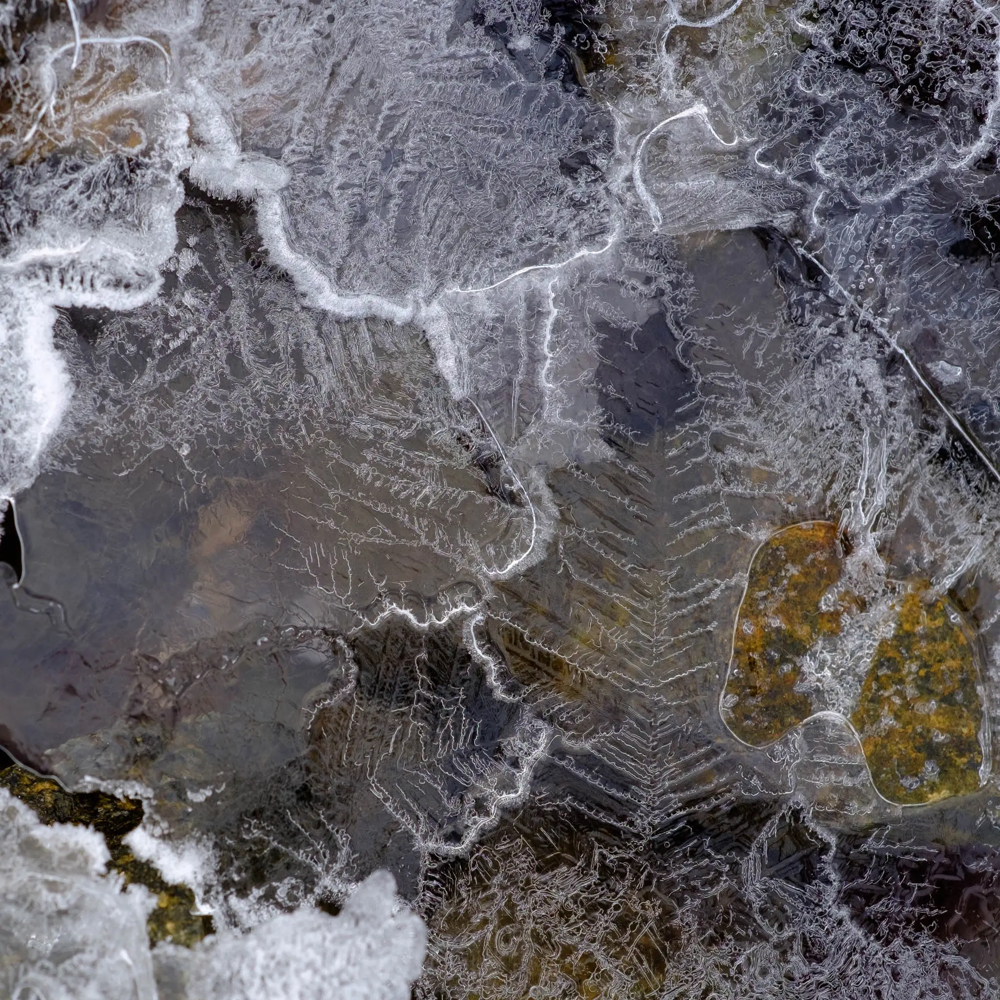
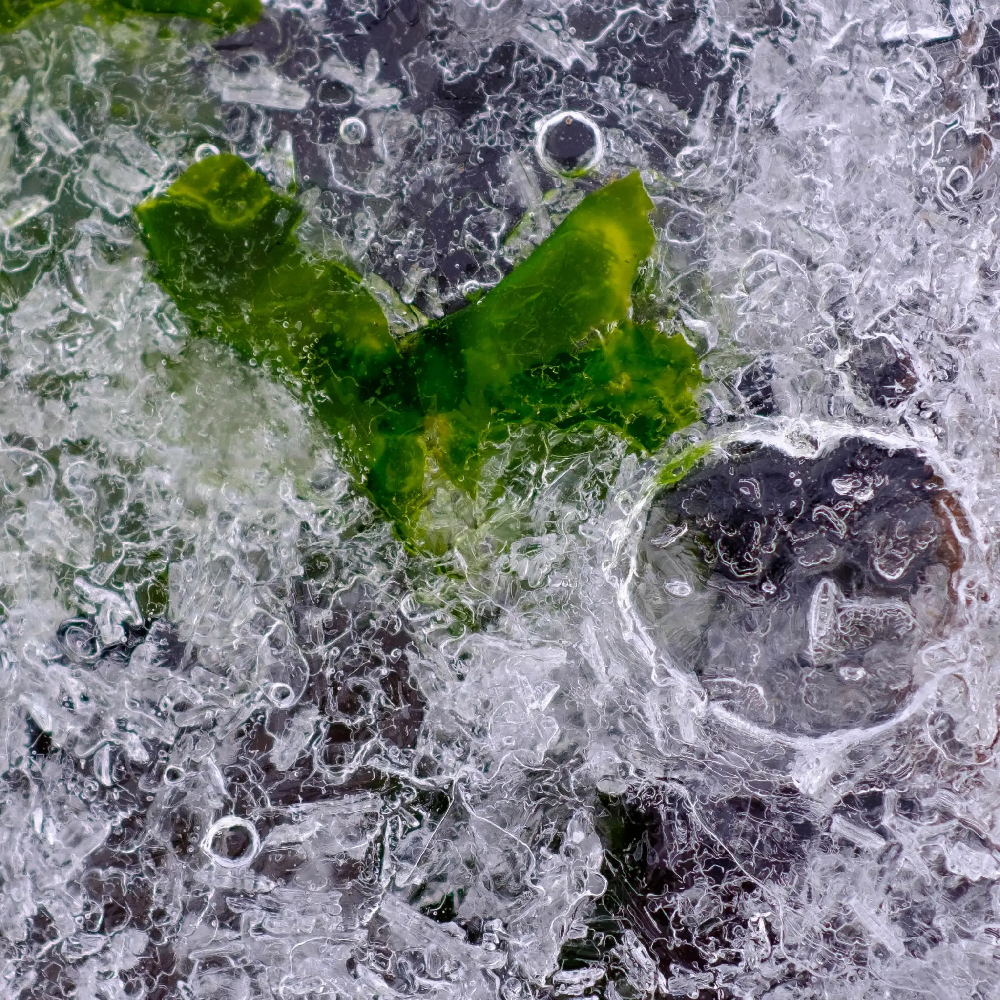
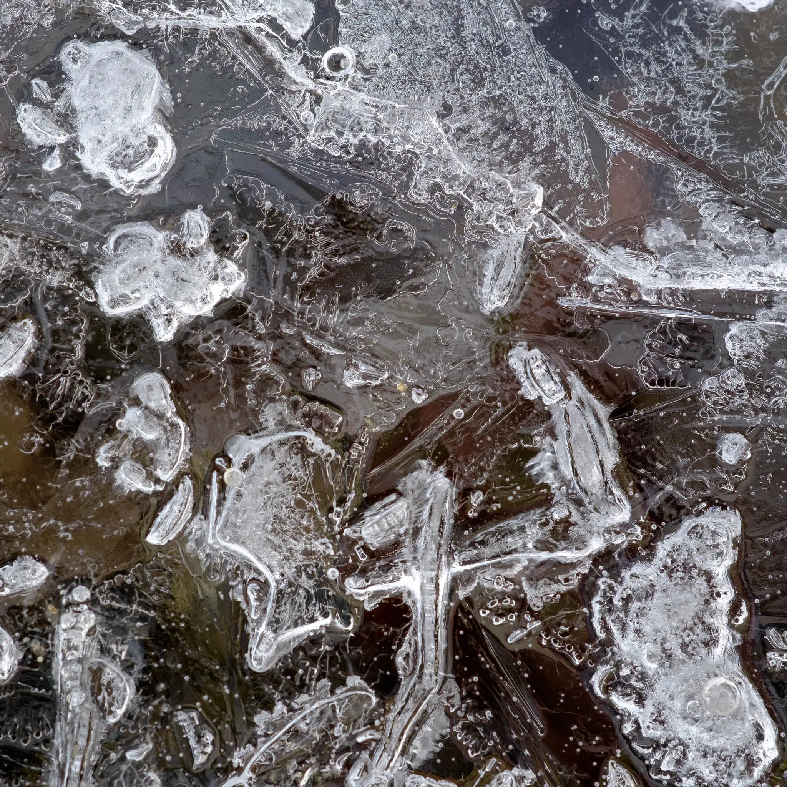

{{page.title}}

{{page.date}}

My recent trip to Iceland provided numerous options for big vistas. But also quieter moments of more introspective imagery.

In the Snæfelsness peninsular there are some lovely fjords with magical pastel light. The contrast between freezing temperatures, wild winds and epic views and the gentle eau-de-nils, pinks and yellow pastel colours was unexpected.

Kolgrafafjörður provided great subject matter including large amounts of crushed ice, and thin ice coatings at the shoreline. As someone who loves the detail in a landscape I couldn't resist.

Here's a small portfolio titled Filigree consisting of 8 square images. 

[{{page.previous}}](2021-01-13-lip-chronicles-life-in-lockdown)

[{{page.next}}](2021-01-13-warped-topographies-ii)