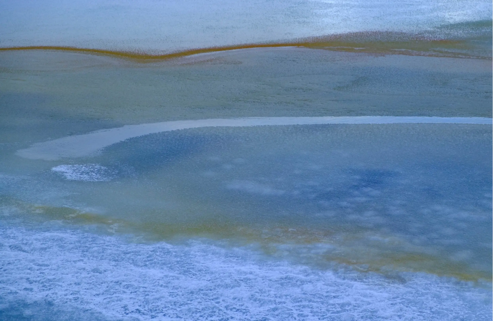

# {{page.title}}

## {{page.date}}

It isn't often that I get to shoot images when the weather is -3C, with 20m/s winds, in the middle of a snowstorm, while the sun still shines, but I'm mightily glad I did with this set.

They were all shot on a frozen lake in Rif in the Snaefelsness peninsular of Iceland using the Fuji 55-200 to isolate the elements.

I had noticed the lake the night before but  the light was too flat, but could see the potential of the shapes, colours and what it would look like in the right light. Despite the prevailing weather conditions, the next morning provided that light.

[The title reflects](../those-lost-souls) my thinking that the shapes and forms reminded me of Tolkein's Dead Marshes from the Lord of the Rings (a book I detest - possibly the worst summer holiday ever was spent reading it!). But also these images took on a greater significance as I [genuinely thought I'd lost them](2016-03-15-those-lost-souls). Anyone who has ever experienced that knows just how sick you feel. Thanks to Rescue Pro the images were all there and all recovered. But not until i had returned to England

There are even elements of the cloud patterns of Jupiter to be seen in the shapes; so being lost, far away with the possibilities lurking below all helped inform this work.

[{{page.previous}}](2021-01-13-lip-chronicles-life-in-lockdown)

[{{page.next}}](2021-01-13-warped-topographies-ii)