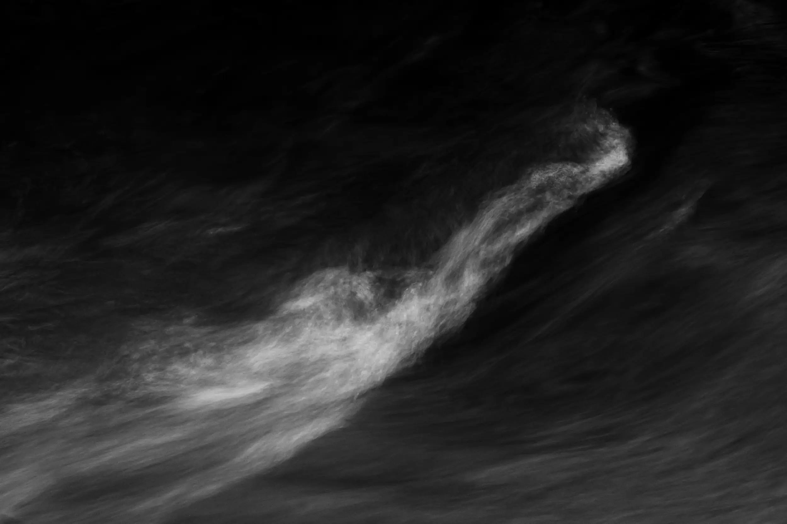

# {{page.title}}

## {{page.date}}

I'm pleased to announce that one of my images, *Flow*, has been selected to be part of the Royal Photographic Society Biennial 2017.

From the RPS website:

> "Members worldwide were invited to submit their images to an open call competition, which was reviewed by a selection panel. The selected work celebrates the diversity of imagery being created by our community of members, at all levels of photographic practice.

> The exhibition tours the UK from March and also includes work from some of The Society’s Honorary Fellows, which has provided the selected photographers the rare opportunity to exhibit their work alongside some of the most respected names in photography today."

The exhibition dates are:

> 4–26 Mar - Shire Hall Gallery, Stafford 
1–16 Apr - intu, Watford 
22 Apr–3 Jun - The Point, Doncaster 
24 Jun–5 Aug - Warrington Museum and Art Gallery, Warrington 
18 Aug–21 Sep - Washington Arts Centre, Washington 
30 Sep–12 Oct - Hull International Photo Festival, (Hull City of Culture) 
4 Nov–7 Dec - Royal Albert Hall, London. The exhibition can be viewed when attending performances or on a number of free public open days - dates TBC.

