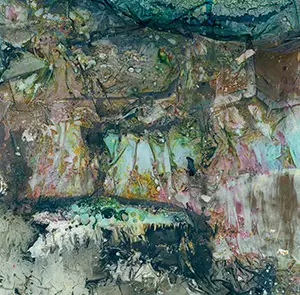

# {{page.title}}

## {{page.date}}

One of my newer Warped Topographies has been selected for [Prime Editions' Happy Accidents](http://prymeeditions.com/happy-accidents-september-2017) September 2017 online exhibition.

The joy and frustration of shooting instant film is that you can't always guarantee what you will get. The process of my Warped Topographies series has been to use that unpredictability and  push it as far as possible.

The [Happy Accidents](http://prymeeditions.com/happy-accidents-september-2017) exhibition highlights 40 images which have become works of art in their own right.

[{{page.previous}}](2021-01-13-lip-chronicles-life-in-lockdown)

[{{page.next}}](2021-01-13-warped-topographies-ii)