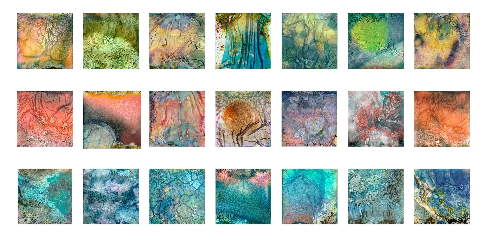

#### {{page.date}}

I am delighted and proud to announce that I have just been awarded the Fellowship of the Royal Photographic Society with my panel of Warped Topographies Polaroids.

This project has been my obsession for the last 20 months (as you might have spotted!)

As usual with a creative endeavour such this it doesn’t come without help, encouragement and inspiration from many sources.

So in typical Oscars fashion thanks must go to: [Mark Gould](http://siark.com/) for pointing out that this set of images could form the basis of a Fellowship Panel.

For general encouragement along the way, [Sean McCormack](http://seanmcfoto.com/), [Rob Knight](http://www.rkphotographic.com/), [Tim Parkin](https://www.onlandscape.co.uk/) and [Karl Mortimer](http://www.karlmortimer.com/).

For deeper encouragement during existential crises, [Rob Hudson](http://www.robhudsonlandscape.net/) and [Al Brydon](http://www.robhudsonlandscape.net/).

[Paul Mitchell](http://www.paulmitchellphotography.co.uk/) who mentored me through the choppier waters of the Fellowship Process.

Instagram user [Florintintin](http://instagram.com/flointintin) who provided some early technical advice!

[Paul Kenny](http://www.paul-kenny.co.uk/) whose work provided huge amounts of inspiration and also showed that creative work needs time and patience (although I'm not sure any of my images took multiple months to produce!)

And of course, my wife Janette, and my children Charlotte and Harry, who have had to put up numerous Polaroids strewn around the house and lots of. "What do you think?…"

