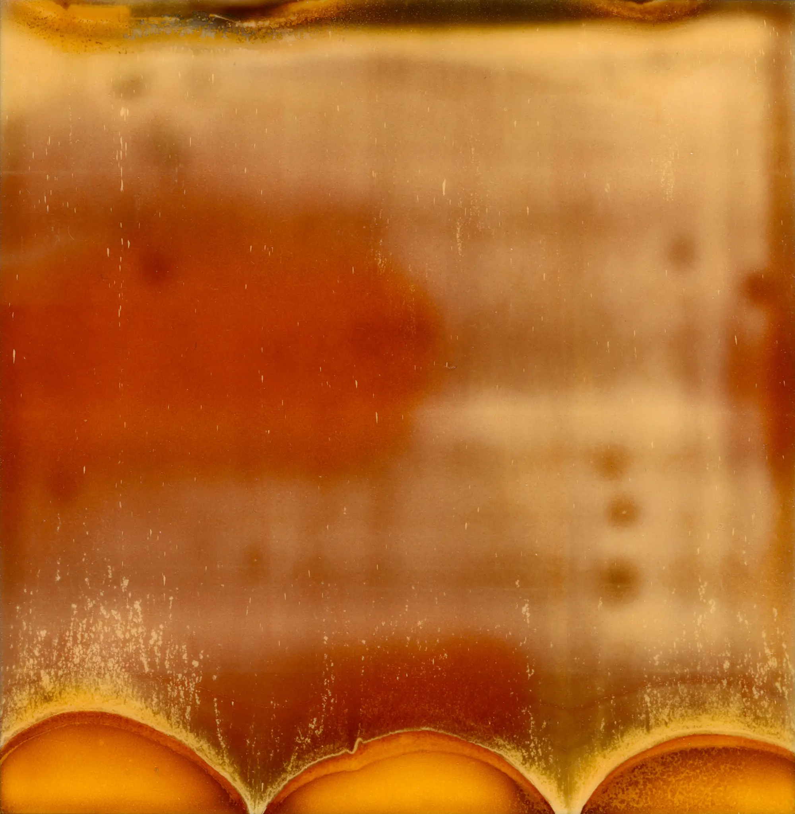

{{page.title}}

{{page.date}}

Today (March 26th) marks the second anniversary of my first Warped Topographies post on Instagram, a series that has become something of an obsession ever since. It was a project that I’d begun about a month before and I decided to use Instagram as a diary and post it all.

But three years before that this Polaroid was the genesis of the project. I had been playing with a Polaroid camera and this image popped out. It was faulty, but I really liked it. Every so often it would reappear on my messy desk and I’d smile at it, thinking failures can be beautiful too. But it wasn’t until February 2016 that it all clicked.

If you would like a print, then visit my store. Three framed prints will be part on the [#Connected 2018](http://www.connected-exhibition.co.uk/connected2018-launch-event) exhibition in April, so if you’re in the Nottingham area come along to that!

Thank you to everyone who has liked, encouraged, shared and bought this series, you are all wonderful 😄

[{{page.previous}}](2021-01-13-lip-chronicles-life-in-lockdown)

[{{page.next}}](2021-01-13-warped-topographies-ii)