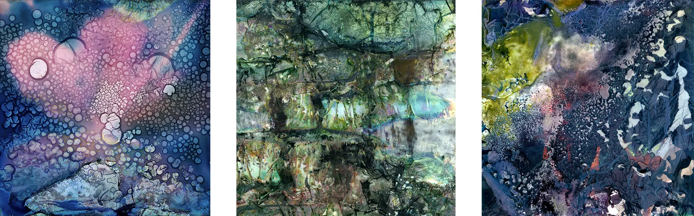

# {{page.title}}

## {{page.date}}

Until May 6th, these three Warped Topography images are being exhibited at the Patchings Gallery in Nottingham as part of the #Connected2018 exhibition.

Each is available as a framed print for £95, of which £50 will be donated to Young Minds the #Connected2018 suggested charity.

If you would like to buy one please contact Patchings Art Centre or contact me via Email.

You can also visit the Connected Exhibition Charity Auction site and bid on a huge number of items and it all for a great cause!

[{{page.previous}}](2021-01-13-lip-chronicles-life-in-lockdown)

[{{page.next}}](2021-01-13-warped-topographies-ii)