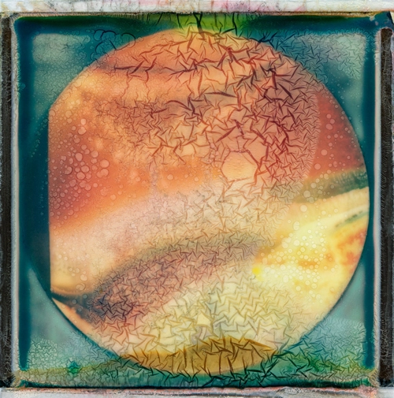

#### {{page.date}}

I am thrilled to announce that [Kozu Books](https://www.kozubooks.com/books-new/richard-earney-warped-topographies) will be publishing my book Warped Topographies in July 2018.

Kozu Books are well known for their high quality small format Landscape Editions. This will be a bit different as befits the rich textures of this series.

### BOOK DETAILS

**Size:** 215mm X 268mm Portrait 
**Soft Cover:** Fedrigoni Uncoated 300gsm - Matt Laminated Cover 
**Text:** 64pp Fedrigoni Uncoated 170gsm 
PUR Bound

**Please note:** This is a bigger publication than our Landscape Edition series.

UK Shipping via Royal Mail 
International orders are sent via Royal Mail

You can pre-order the book now from Kozu for £14, it ships in early July

