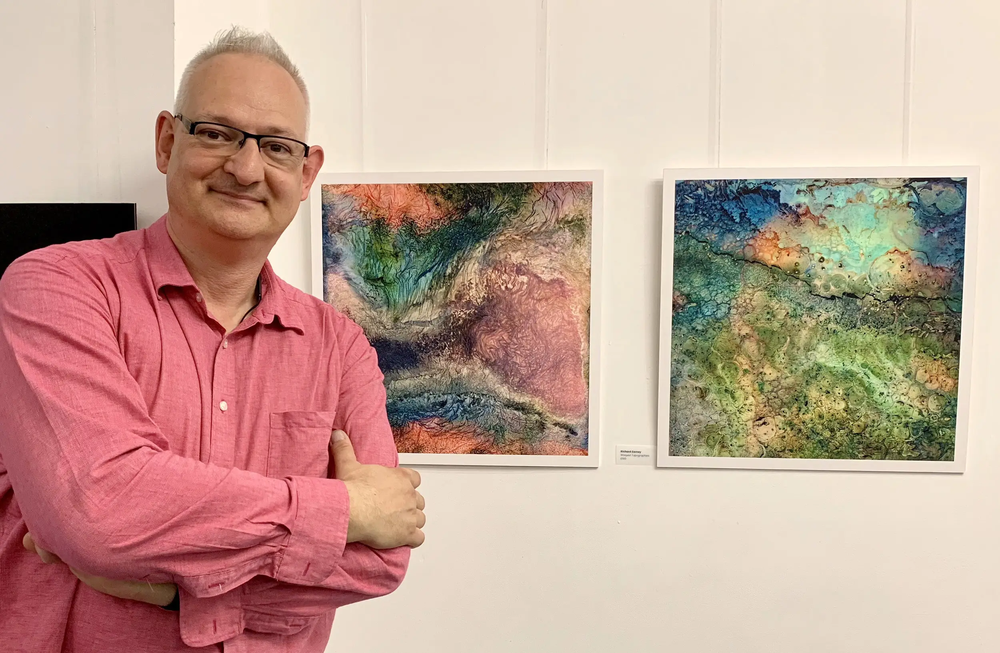

# {{page.title}}

## {{page.date}}

Naturally this is an after the event post, but last week I had two Warped Topographies in the [London Independent Photographers](http://www.londonphotography.org.uk/) 30th (LIP30) [Annual Exhibition](http://www.londonphotography.org.uk/exhibitions/LIP30Annual/).

The LIP30 exhibition is part of the vibrant [Photomonth East London](https://www.photomonth.org/). And it was a real pleasure to have had a couple of images selected for it.

It was held at the Espacio Gallery in Bethnal Green Road, a gallery I really like and have [exhibited](https://method.photo/blog/2016/10/11/rps-international-photobook-exhibition) at before.

The Private View was held on Thursday 4th October and was properly packed! Thanks to all who came along.

These were printed and mounted by Metro Imaging in London. I decided to print these at a larger size than I have previously, so the images were approximately 48cm square, printed onto Hahnemühle Photo Rag 308gsm and then mounted onto 5mm Foamex Board and they certainly worked presented like that. Aside from anything else there were no reflections from overhead lighting which can be a bugbear.

And here’s a pic of me with the image pair, looking pretty happy!

