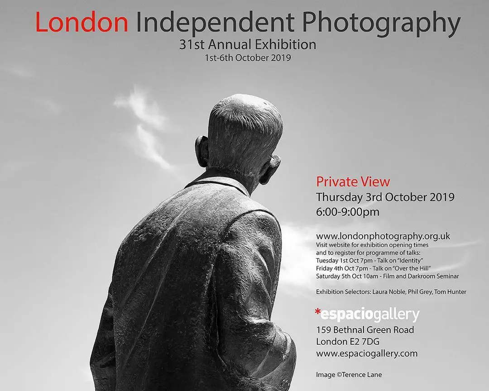
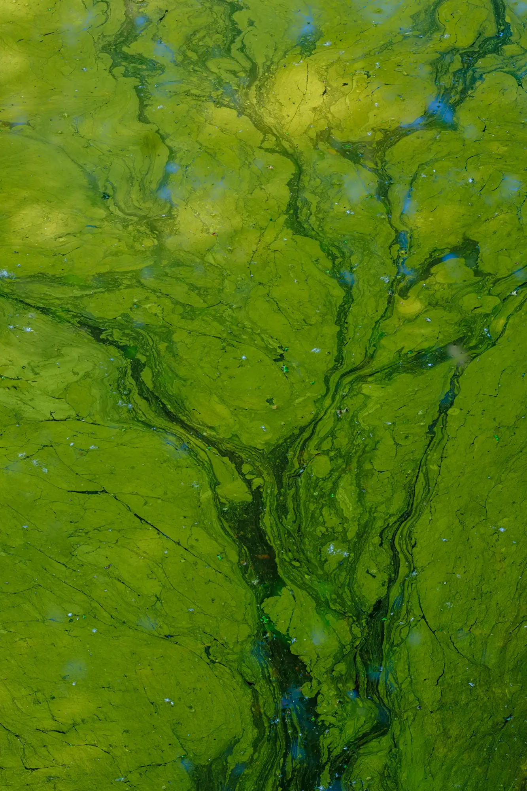

#### {{page.date}}

I am pleased to say that one of my images has been selected for the London Independent Photography (LIP) 31st Annual Exhibition

Exhibition Selectors: Laura Noble, Tom Hunter and Phil Grey

**Exhibition:** 1-6 OCTOBER 2019

Espacio Gallery 

159 Bethnal Green Road 
London E2 7DG

**
Private View:** Thursday 3 October 6pm-9pm

**
Tube:** Liverpool Street Bethnal Green 
**Overground:** Shoreditch High Street 
**
Bus 8:** 388; 
5 minutes walk from Brick Lane

[Other events](http://www.londonphotography.org.uk/LIPevents.php) taking place during the week

