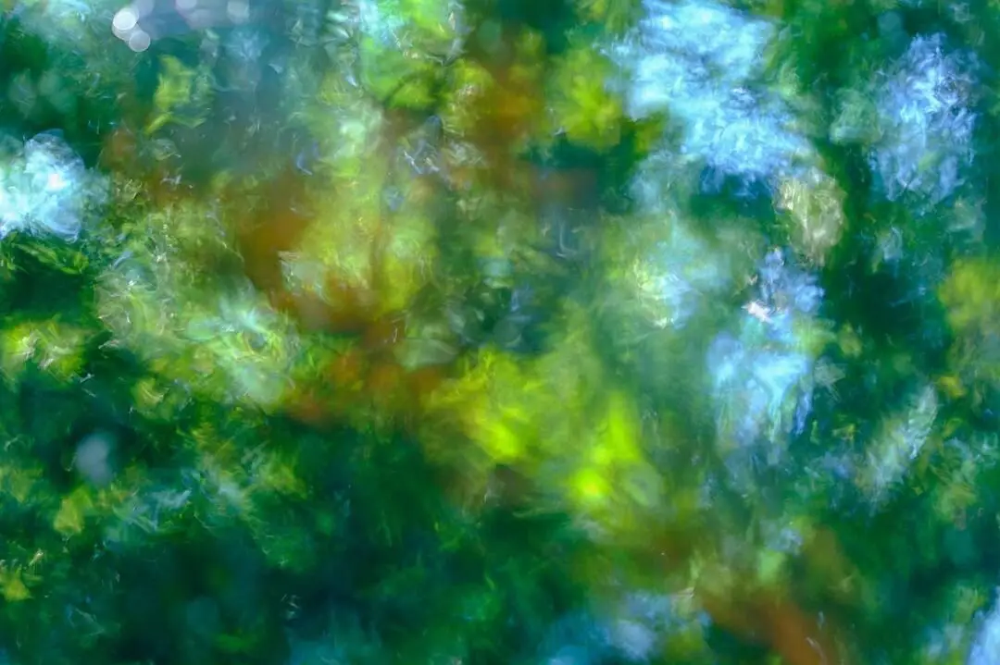

#### {{page.date}}

2020 may not have been the year to have exhibitions and private views, but [London Independent Photography’s](https://www.londonphotography.org.uk/) annual exhibition was replaced by the [LIP Chronicles](https://www.instagram.com/p/CIGUs1YnhsE/) which was a website, Instagram feed and a newspaper reflecting on life in lockdown

One of my abstract images was featured, *Summer Shimmer, Water Ripple*, which was made on one of my many summer walks, while permitted.

