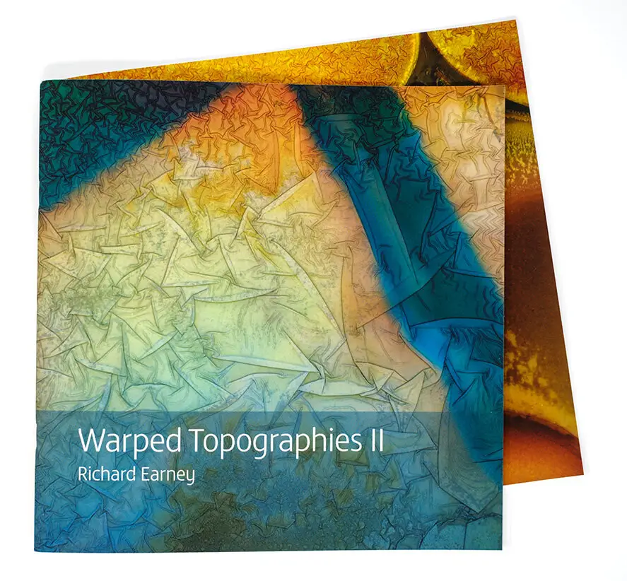

#### {{page.date}}

One lockdown project was publishing *Warped Topographies II*. This is a second collection of Warped Topographies following the publication of the original book in July 2018 by [Kozu Books](https://www.kozubooks.com/books-new/richard-earney-warped-topographies).

This new book presents two images which date back to the origins of the project, but most have been made in the last two years since the publication of the original book. I’ve continued making images on a regular basis, sometimes beginning with abstract imagery, sometimes using portraits of people and politicians. More often than not I have added new elements including ink, and chemicals such as copper sulphate.

The first run was a limited edition of 50 and sold out very quickly. There are --still some slight seconds left--, which are almost as good as the original edition, but one page has a slight blue streak in the margin of one page.

You can see more of both [Warped Topographies](https://biblioscapes.com/library/warped-topographies) and [Warped Topographies II](https://biblioscapes.com/library/warped-topographies-ii) at [Biblioscapes](https://biblioscapes.com/), and you can hear a podcast with me [talking about Warped Topographies II](https://biblioscapes.com/in-discussion/richard-earney) also at Biblioscapes.

