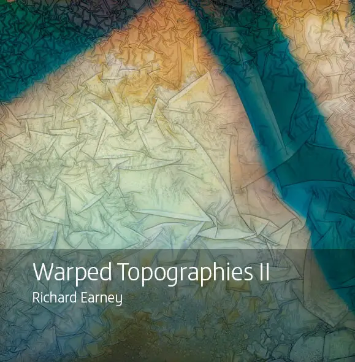

# {{page.title}}

### {{page.publisher}} {{page.year}}

This is a second collection of Warped Topographies following the publication of the original book in July 2018 by [Kozu Books].

This  book presents two images which date back to the origins of the project, but most have been made in the  two years since the publication of the first book. I’ve continued making images on a regular basis, sometimes beginning with abstract imagery, sometimes using portraits of people and politicians. More often than not I have added new elements including ink, and chemicals such as copper sulphate.

The images resemble aerial satellite imagery, with tortured landforms, disrupted river flows, impenetrable forests, glacial melts and ice flows all ‘appearing’ in these handmade  fractured works.

*The editions currently for sale are classed as seconds - there's one page that has a small blue streak on it which doesn't detract from the books, but I mention it for completeness.*

**Specifications**

**Size:** 210mm x 210mm (Square) 
**Soft Cover:** 350gsm Silk paper with soft touch lamination 
**Contents:** 36pp 170gsm Silk paper

**Price:** £7.50 + shipping (UK and EU/RoW)

<stripe-buy-button
  buy-button-id="buy_btn_1N9OKmEYn6r0o2yhD9hu84yU"
  publishable-key="pk_live_S7EHANc4TF7Q5M2Hqwbjzup3"
>
</stripe-buy-button>

