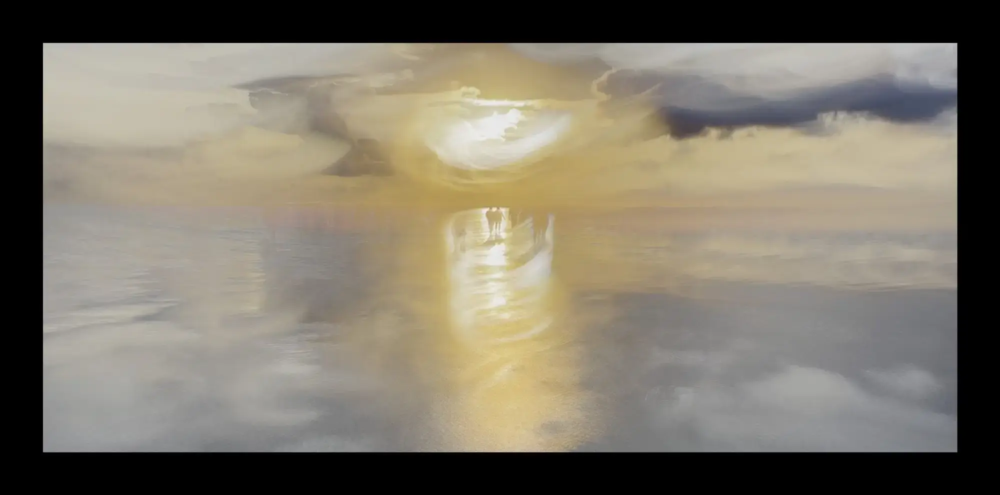
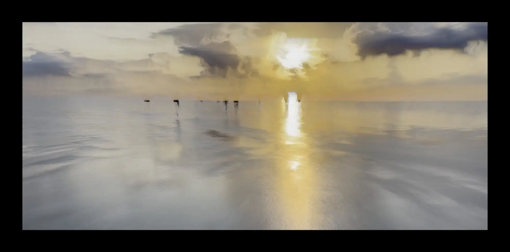
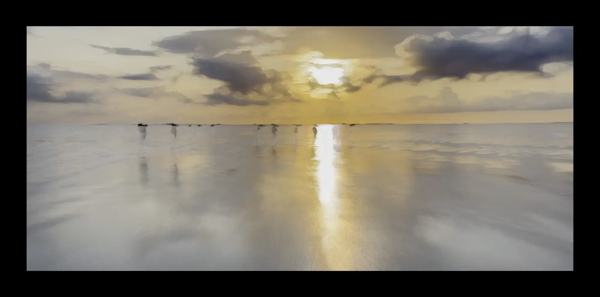
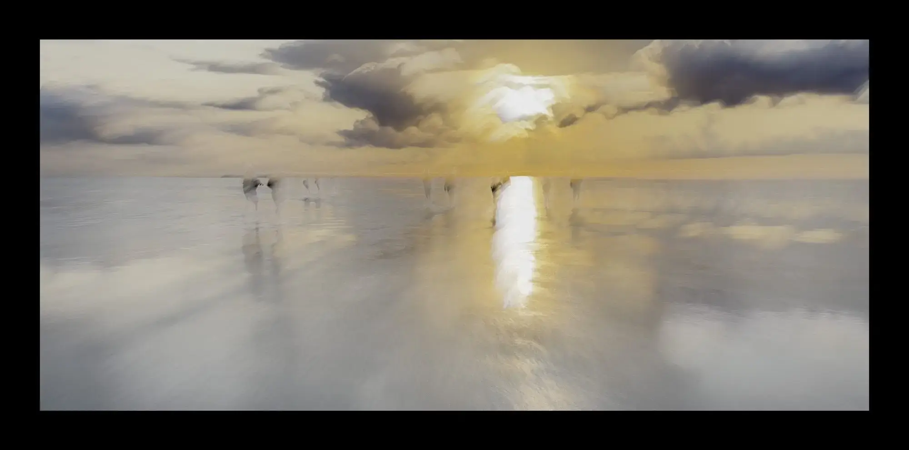
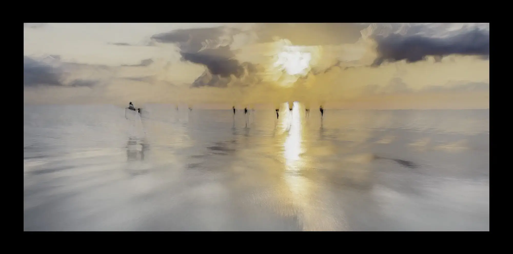
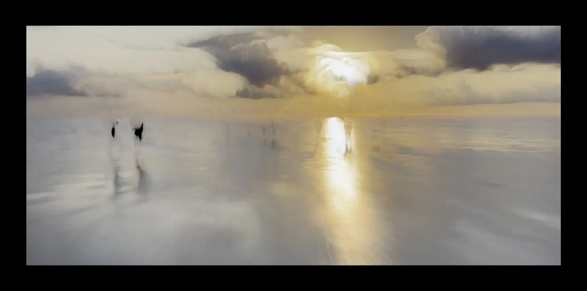
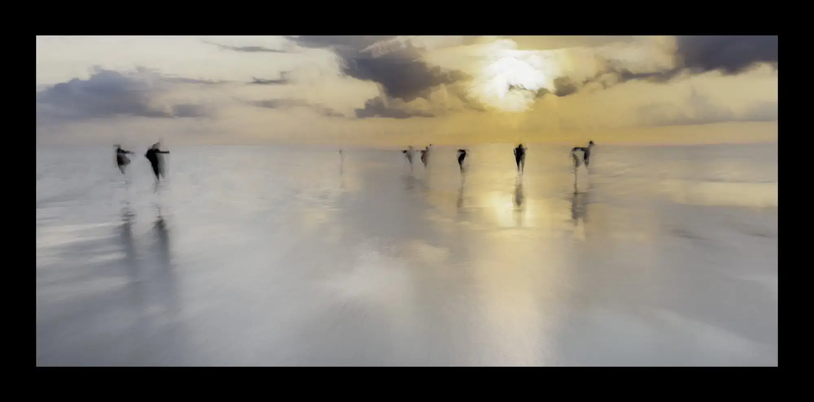
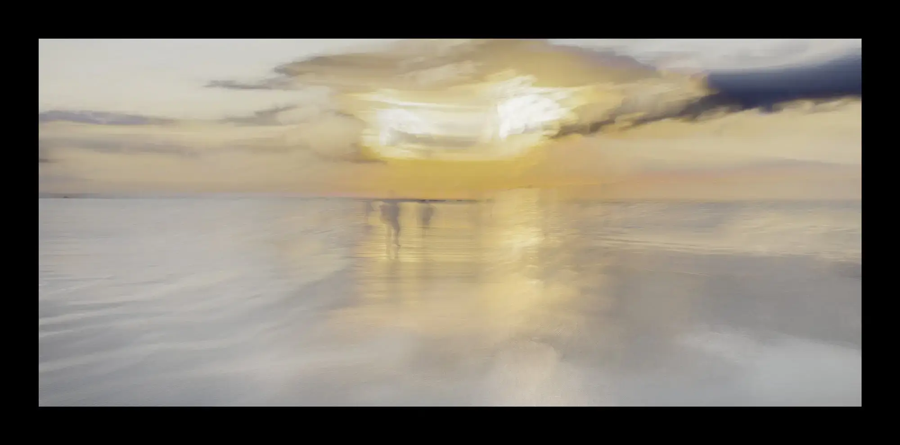
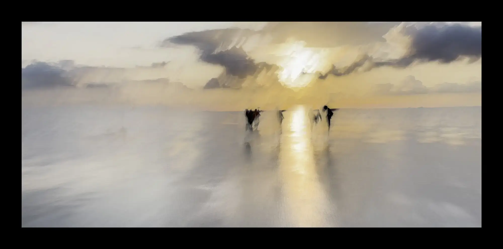
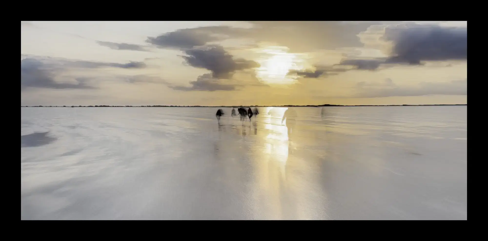

# {{page.title}}

With the setting sun in your eyes as you walk to the shore, you see the ghostly shapes of those who are here and those who have walked these sands before.

The [Broomway](https://www.bbc.com/travel/article/20170110-why-the-broomway-is-the-most-dangerous-path-in-britain) is one of the Old Ways mentioned in the Robert Macfarlane book of the same name and is reputedly Britain’s most dangerous path.

