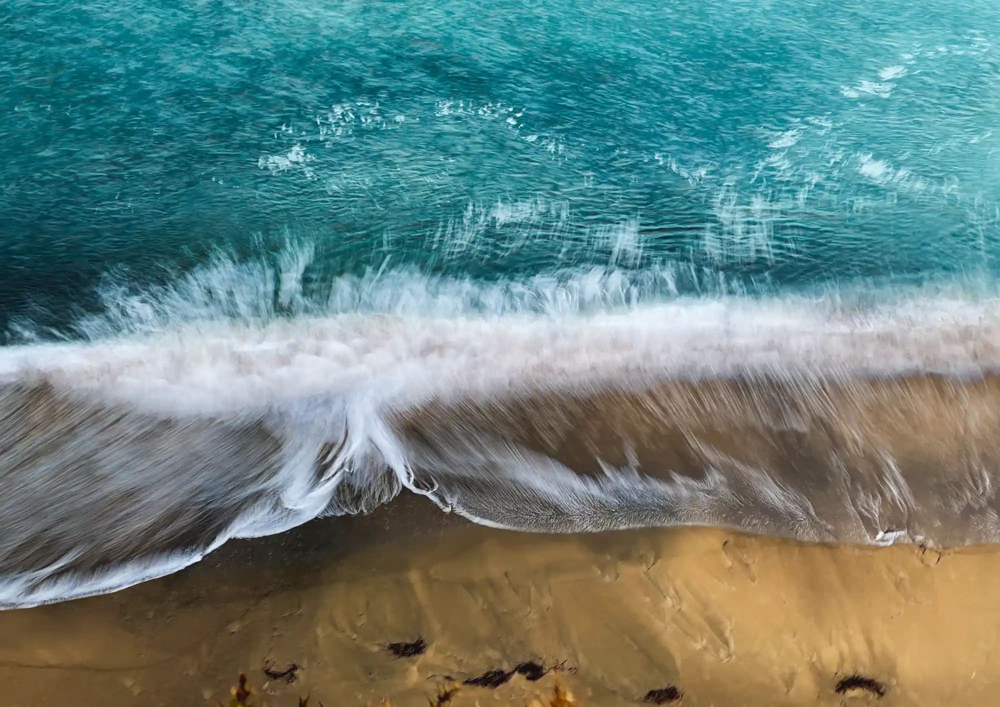
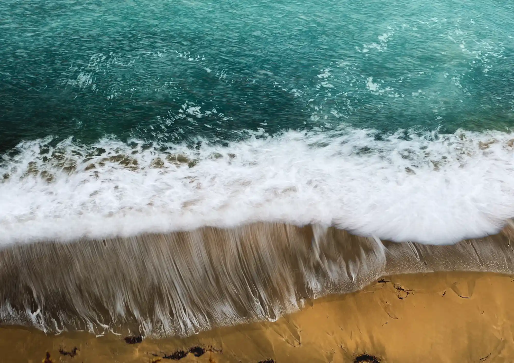
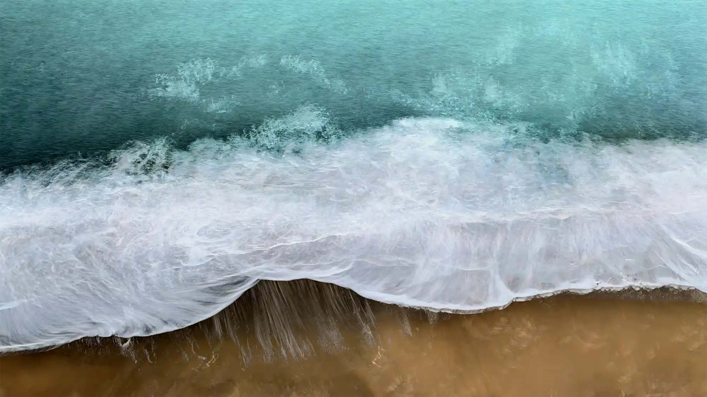

# {{page.title}}

### {{page.year}}

Using a favoured technique, but this time with the sea doing all the work. 

Each time I render images this way I try to improve the process to reduct the potential for glitches. This allows me to create video files too as here.

The technique relies on scripts and Keyboard Maestro control of Photoshop. This time I used AI to refine the scripts, but definitely **not** the images

	<iframe src="https://player.vimeo.com/video/1165109561?badge=0&amp;autopause=0&amp;player_id=0&amp;app_id=58479&amp;autoplay=1" frameborder="0" allow="autoplay; fullscreen; picture-in-picture; clipboard-write; encrypted-media; web-share" referrerpolicy="strict-origin-when-cross-origin" style="position:absolute;top:0;left:0;width:100%;height:100%;" title="I Am the Sea Alone"></iframe>

Music © Jean-Michel Jarre

