# {{page.title}}

### {{page.year}}

Think of that first light on a cold morning; winter on the cusp of spring. It is a clear and pure light; shimmers and scintillations as the light falls onto a patch of fresh-growth leaves.

 One such morning, close by my favourite pond, I looked through the trees and saw this light. It seemed like there was so much that could fit into the frame. Every few metres there was something there. I felt like I was looking through an image and seeing a thousand more.

After a bit of experimentation I realised that to present these images I couldn't show all that I could see, I needed to do the opposite, defocus, and allow the viewer to feel it rather than explore it.

And in doing so I was reminded of a French pastoral scene from a movie just as Jean de Florette or Manon des Sources where the camera would linger on the scene, out of focus, then snap onto the main character. These images are that moment before the camera snaps into focus. 

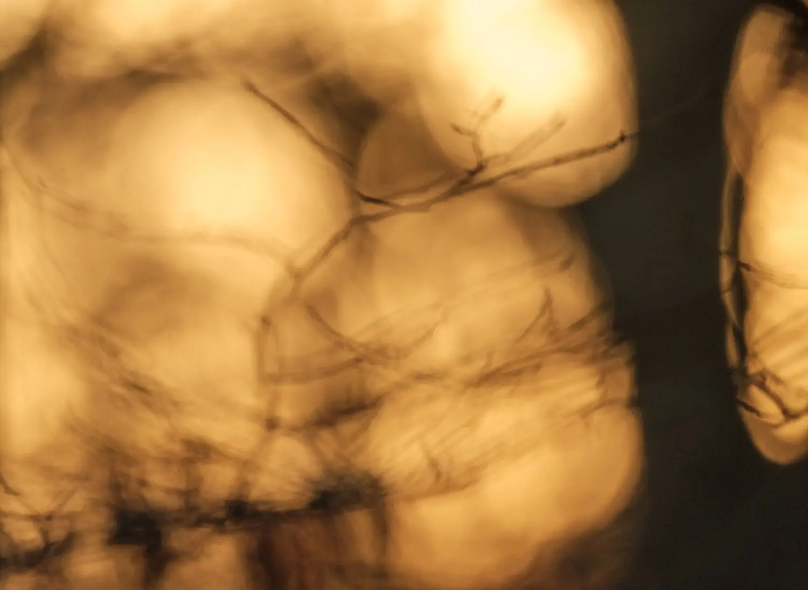

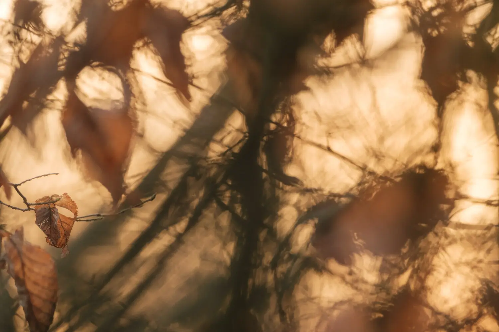

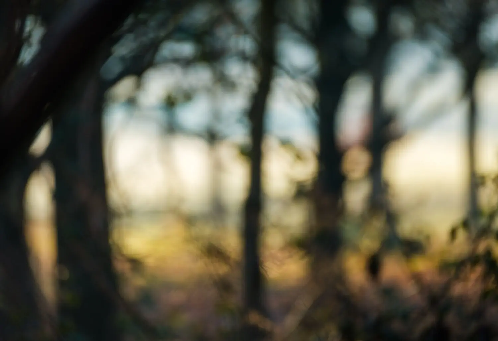

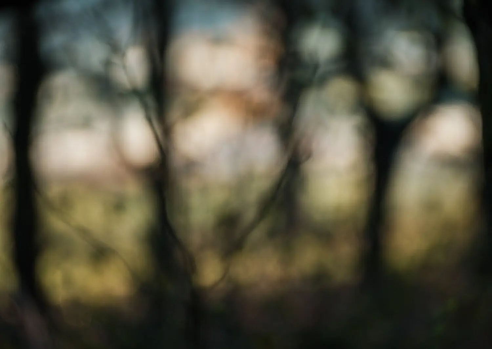

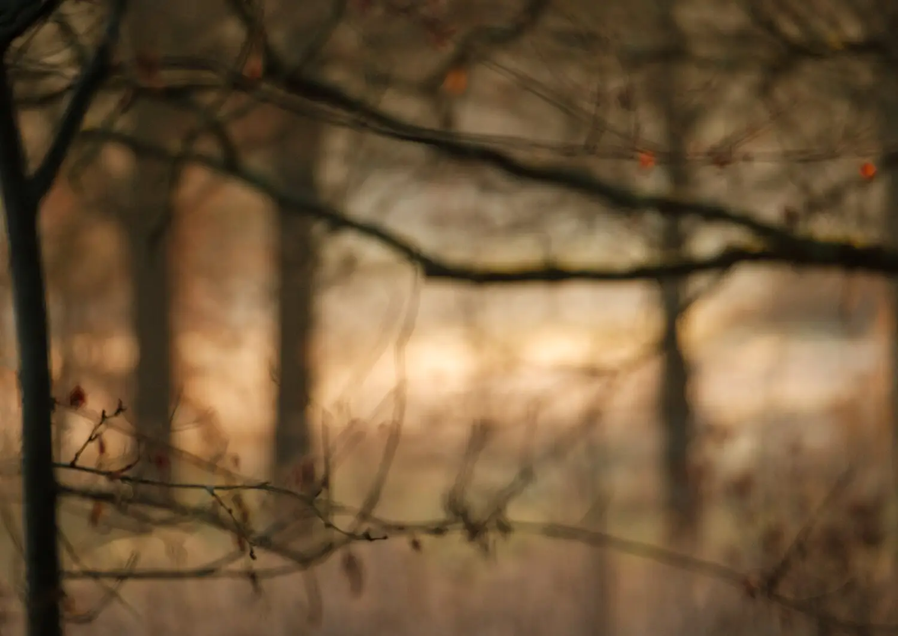

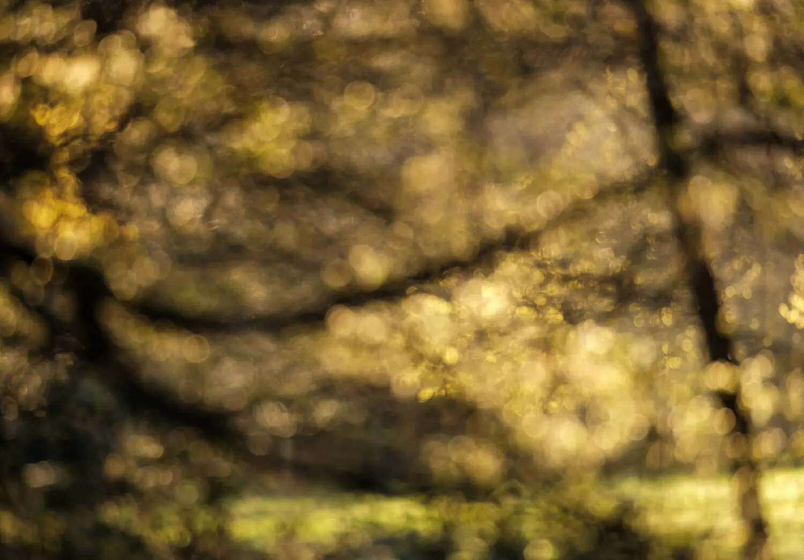

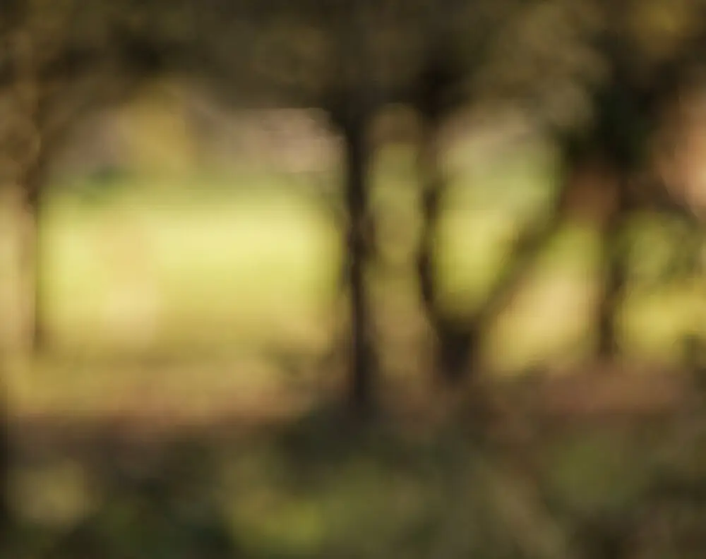

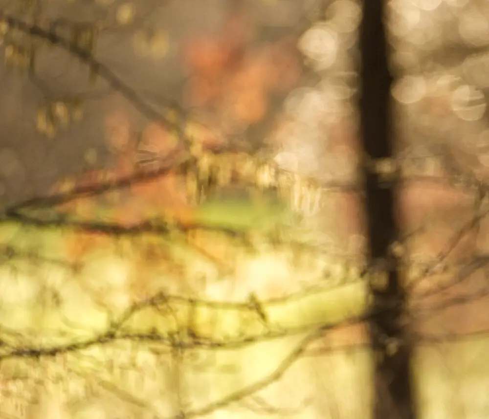

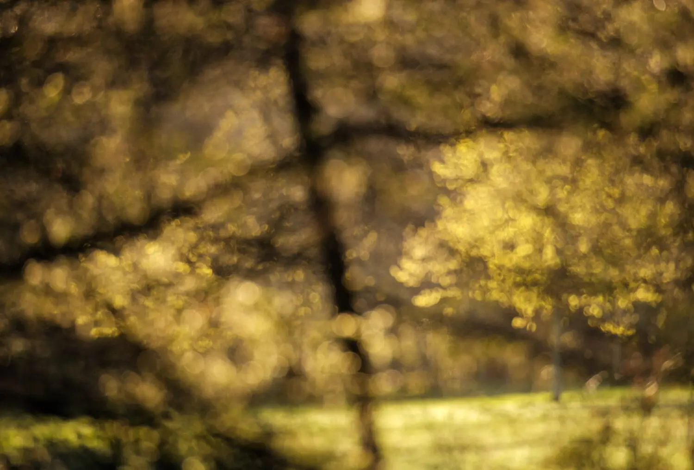

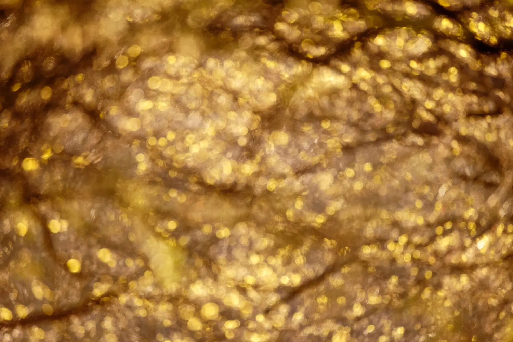

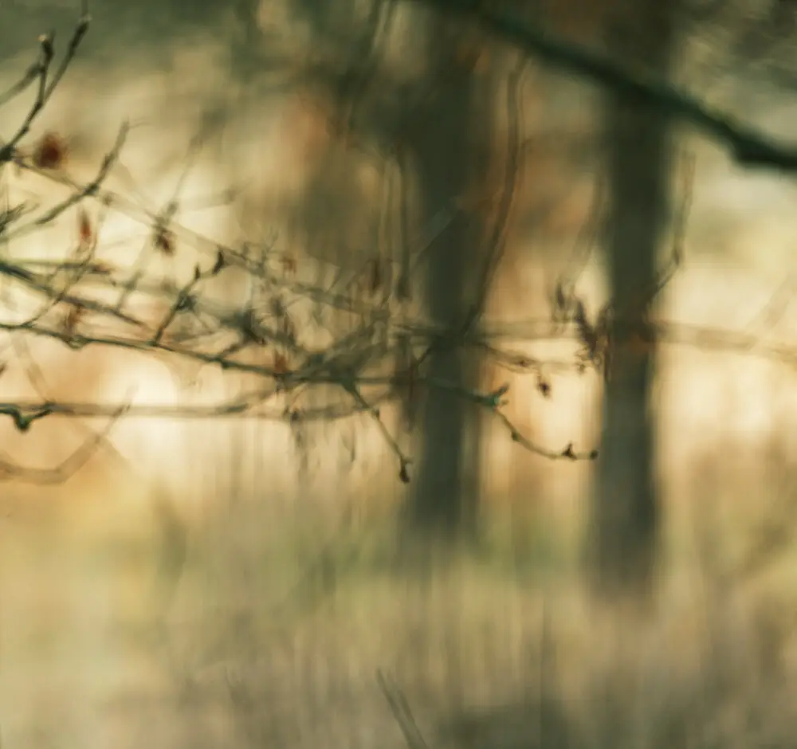

