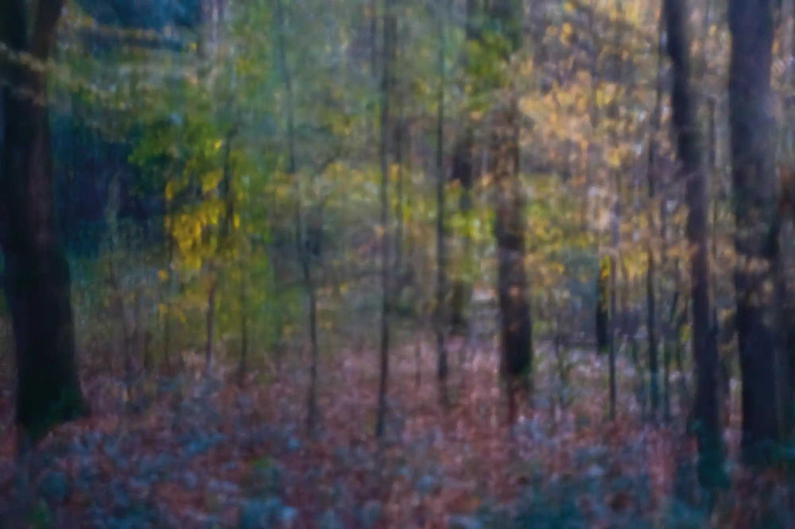
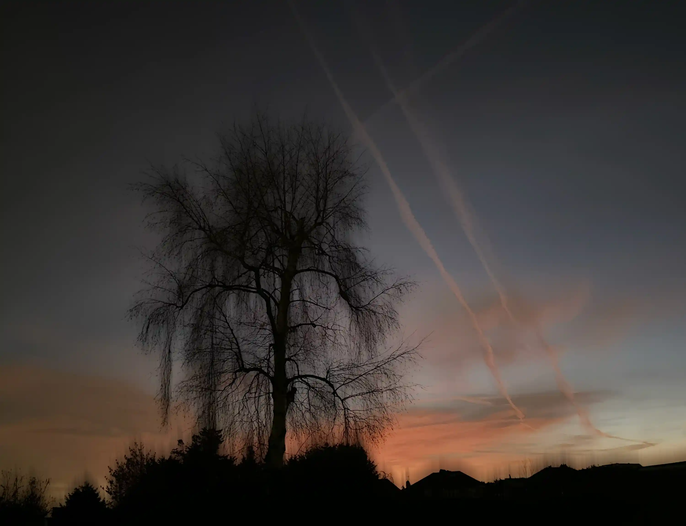
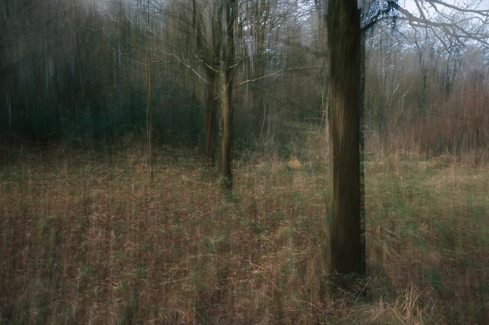
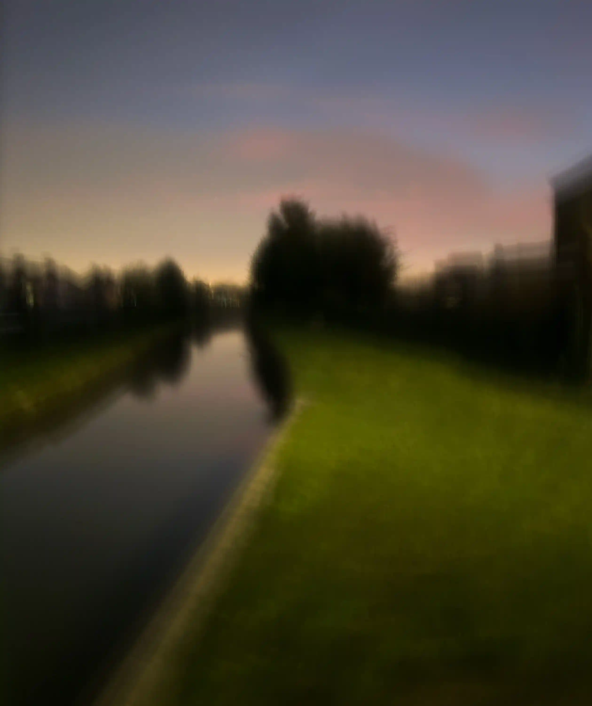
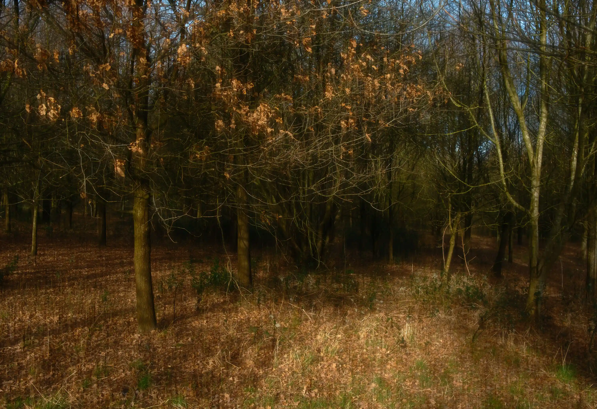

# {{page.title}}

### {{page.year}}

It's dusk in autumn and winter. The day is ending, The dark is closing in. In that half-light there are still images out there and there is still colour. 

The images are still, but contain a sense of movement. This time is the Shudder Light.

