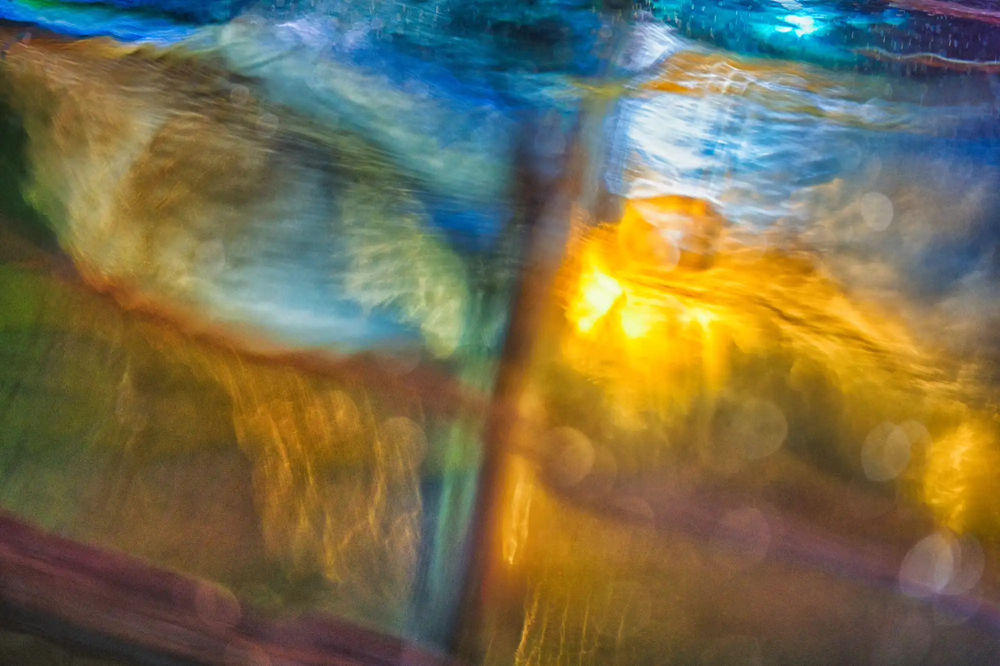



# News

## Featured Gallery

### I'm Lost at Sea, Don't Bother Me, 2024



  <button class="home-carousel__arrow home-carousel__arrow--prev" type="button" aria-label="Previous image" data-carousel-prev>&#8592;</button>
  <button class="home-carousel__arrow home-carousel__arrow--next" type="button" aria-label="Next image" data-carousel-next>&#8594;</button>
  
    
  





Three images from this series showed at [The Original Gallery](https://www.londonphotography.org.uk/upcoming/2025/02/19/lip-crouch-end-annual-exhibition/) in Crouch End and [Framed prints](im-lost-at-sea-dont-bother-me/) are available.


