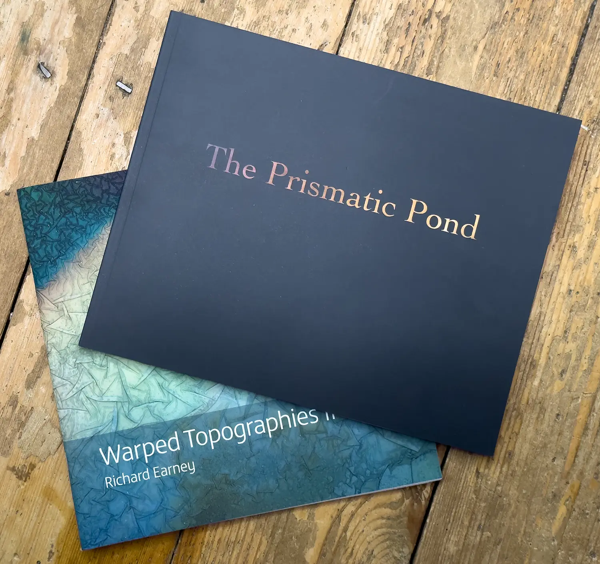

<a href="https://method.photo/books/warped-pond">
	<button class="links">
		Buy Warped Topographies II and The Prismatic Pond
	</button>
</a>

<a href="https://method.photo/books/the-prismatic-pond">
	<button class="links">
		Buy The Prismatic Pond
	</button>
</a>

<a href="https://method.photo/books/warped-topographies-ii">
	<button class="links">
		Buy Warped Topographies II
	</button>
</a>

 

<a href="https://method.photo">
	<button class="links">	
		Method Photo
	</button>
</a>

<a href="https://vimeo.com/449190135">
	<button class="links">
		One Misty May Morning video
	</button>
</a>

<a href="https://biblioscapes.com/in-discussion/richard-earney-1">
	<button class="links">
		Biblioscapes In Discussion 08/12/2022
	</button>
</a>

<a href="https://biblioscapes.com/in-discussion/richard-earney">
	<button class="links">
		Biblioscapes In Discussion 08/10/2020
	</button>
</a>

<a href="https://method.photo/blog/2019-07-16-an-interview-with-paul-kenny.md">
	<button class="links">
		An Interview with Paul Kenny
	</button>
</a>

<a href="https://glass.photo/methodphoto">
	<button class="links">
		Glass.Photo
	</button>
</a>

<a href="https://threads.net/@methodphotonew">
	<button class="links">
		Threads
	</button>
</a>

