# {{page.title}}

<h2>Instructions</h2>

Tap on your name below to read yours. If there are corrections, please let me know via <strong>WhatsApp 07710 248 896</strong>, <em>not by email as it might get lost</em>.

<h3>If your biography is here:</h3>

<ol>
	<li> If it seems shorter, then it's been edited before to fit based on ones I've had in the past</li>
	<li>Please indicate via <strong>WhatsApp</strong> which link you would like to be made into a QR code for the exhibition panel; email or one of your Social Media addresses 1 QR code per person.</li>
</ol>

<h3>If your biography is not here:</h3>

<ol>
	<li>Please send it to me <strong>WhatsApp only</strong> in the same style as the ones on the page and try to be concise!</li>
</ol>

<h3>Deadline: Sunday 9th February - Midnight!</h3>

 - [Carole Rawlinson](#carole-rawlinson)
 - [Elizabeth Brown](#elizabeth-brown)
 - [Eva Turrell](#eva-turrell)
 - [Gordana Johnson](#gordana-johnson)
 - [Haim Bresheeth](#haim-bresheeth)
 - [Jayne Selvaggio](#jayne-selvaggio)
 - [John Tolliday](john-tolliday)
 - [Derek Cottrell](#derek-cottrell)
 - [Mary Thompson](#mary-thompson)
 - [Reza Tavakol](reza-tavakol)
 - [Sabrina Merolla](sabrina-merolla)
 - [Richard Earney](richard-earney)
 - [Sandra Roberts](sandra-roberts)
 - [Sonia Davda](#sonia-davda)
 - [Robin Barr](#robin-barr)
 - [Sonia Hunt](#sonia-hunt)
 - [Kasia Kowalska](kasia-kowalska)
 - [Don Holtum](don-holtum)
 - [Mal Woodford and Charlotte Woolford](mal-woodford-and-charlotte-woolford)
 - [Paul Plummer](paul-plummer)
 
 
## Carole Rawlinson FRPS

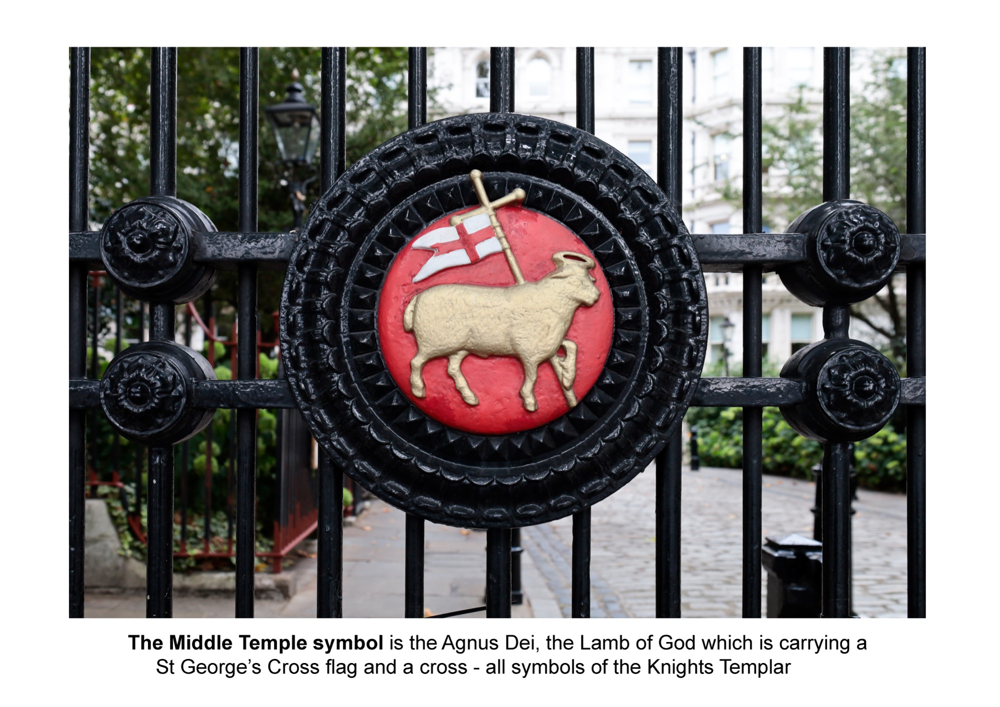

Carole is a documentary urban and rural landscape photographer. Urban topics include bridges, hospitals, features of Edwardian houses and doorknockers. She is also interested in wild remote landscapes including icy and desert environments, archeology and rock art. Combining text and images is the focus for her Signs and Symbols images in this exhibition. A book about this project can be previewed using the following link: https://www.blurb.co.uk/b/12280903-signs-and-symbols-in-the-city

**Email:** carolerawlinson@virginmedia.com

## Elizabeth Brown

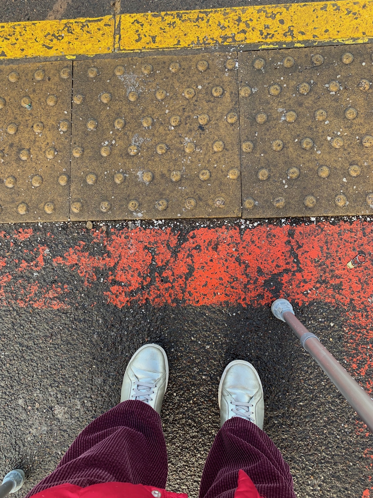

Elizabeth Brown is an artist whose primary mediums are photography and printmaking.

She enjoys working collaboratively, collecting stories and images of objects to learn more about people. Observation is a key element of her work and a need to capture unique images presented to her by life, nature and events. She is fascinated by the random effects of weather and light on her subjects. Nature inspires a large part of her experimental analogue photography and printmaking and she often uses her garden as a darkroom 

**Website:** www.elizabethhaybrown.com 
**Instagram:** @elizabethhaybrown

## Eva Turrell

Eva lives and works in Crouch End. She studied photography at Central Saint Martins
School of Art and Design; the Sir John Cass Faculty of Art (London Met) and the
University of Westminster (BA Hons).

Eva is an active member of London Independent Photography (LIP) and Crouch End
Open Studios. Eva took part in Salon des Refusés, was shortlisted for the Art Gemini Prize
and participated in The Royal Academy Summer Show in 2019.

Eva was one of the winners at The London Invitational 2023 Galeria Moderna. She was
awarded Px3 Honourable Mention in the 2023 Prix de la Photographie de Paris

**Email:** evaturrell@gmail.com 
**Instagram:** @evaturrellphotography

### Gordana Johnson

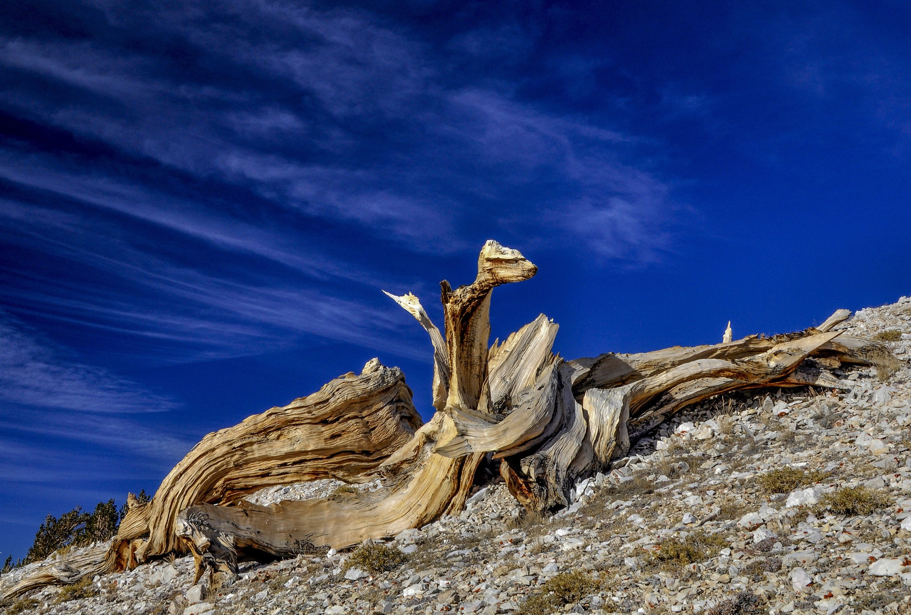

Photography is an intuitive and creative expression of her innerworld as triggered by the
outside world. She photographs anything that excites her inner self without favouring a
particular genre.

**Website:** gordanajohnson.com 
**Instagram:** @gordanajohnson

## Haim Bresheeth

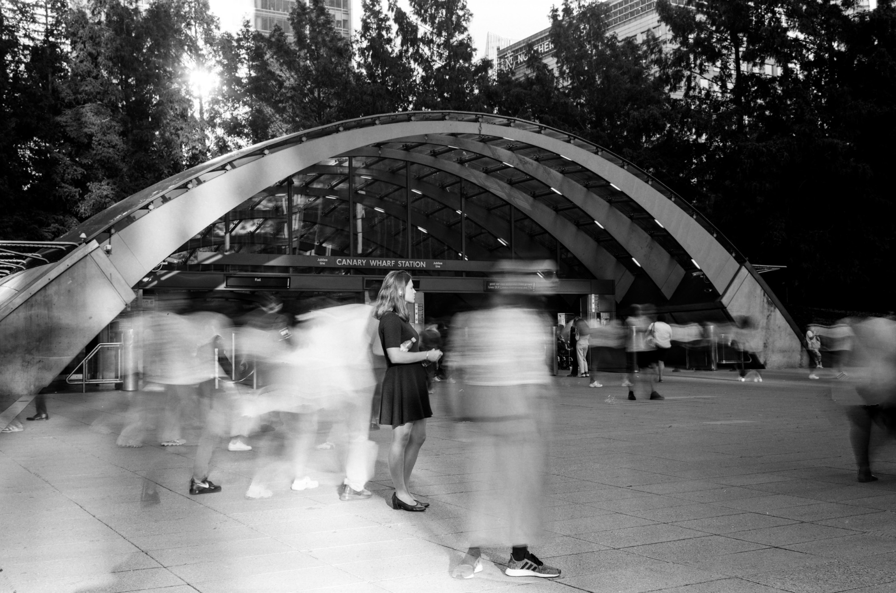

Haim Bresheeth-Žabner is a filmmaker, photographer, film studies scholar and a Researcher at SOAS. His books include Introduction to the Holocaust, The Gulf War and the New World Order. His films include State of Danger (1989, BBC2), London is Burning (2013) and Convivencia at the Turnpike (2015). His most recent book is An Army Like No Other: How the IDF Made Israel, Verso, 2020. He has taken part in photo exhibitions and film festivals abroad.

**Email:** hb26@soas.ac.uk

## Jayne Selvaggio

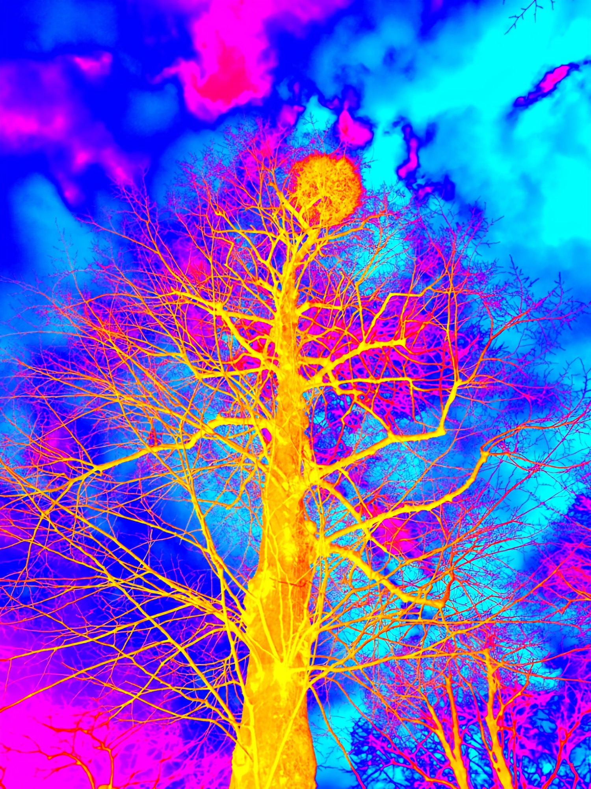

As a visionary, researcher and traveller, in her constant quest to explore the world, her
photographic eye seeks to capture the ephemeral beauty of life’s fleeting moments,
freezing those snatching seconds that would otherwise be lost to the relentless march of
time.

**Email:** jayneselvaggio@gmail.com

## John Tolliday

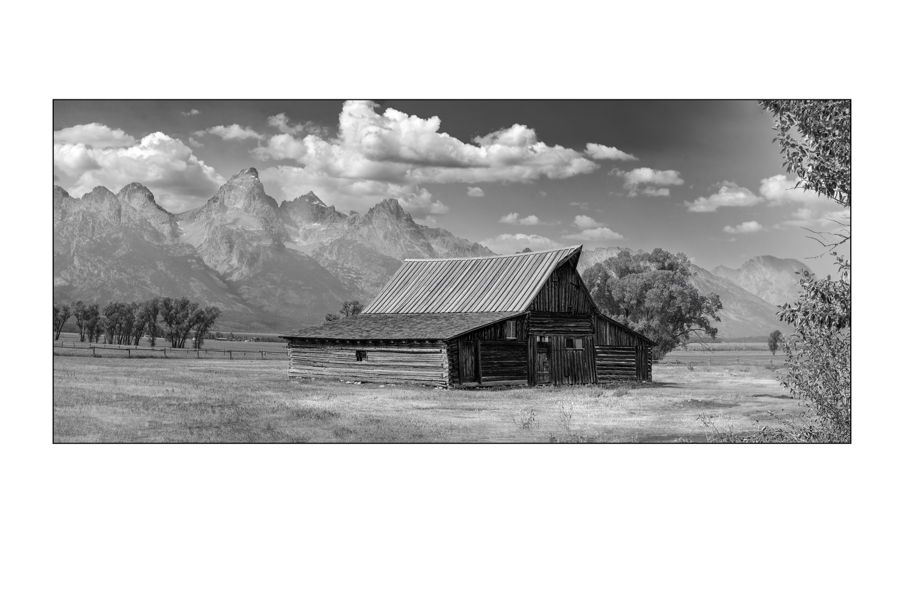

John works in film and digital covering numerous genres which include Landscape, Portrait and Astrophotography.

More recently, alternative processes have been used in his creative work. He is based in the UK and USA.

**Instagram:** @johnphotographerartist 
**Website:** johntolliday.myportfolio.com

## Derek Cottrell

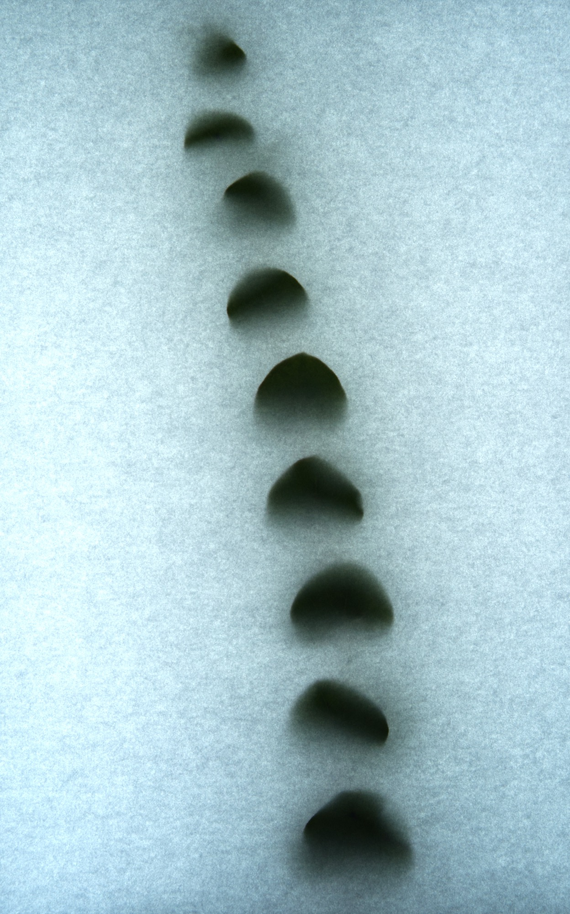

Derek originally became interested in photography in his late teens. His interest in photography somewhat waned and for forty odd years it became just a means to record high days and holidays. In the last seven years he has reconnected with photography. He has had no formal training as such and he finds himself drawn to photography that can be felt rather than be technically perfect.

**Instagram:** @derekcottrell

## Mary Thompson

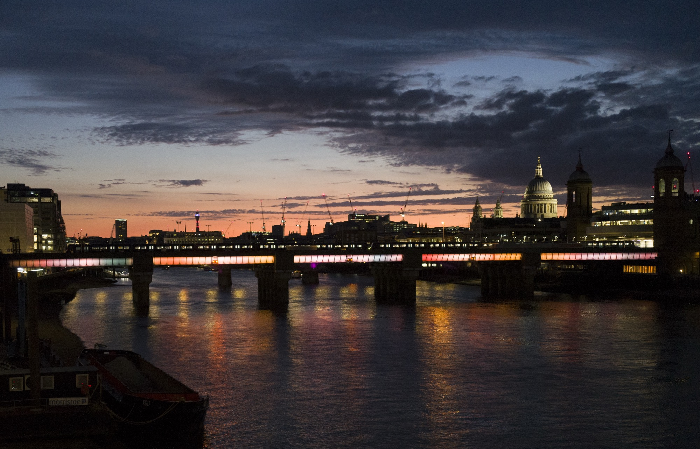

Mary is a political and social documentary photographer. As a photographer she look for ways of telling stories that she cares about that can draw people in more easily than just the written word.

Her photographic projects include Living with Osteoporosis, Activists, the Working Coast, the Climate Crisis and Hospitalisation.

**Instagram:** @mary_thompson68
**Website:** www.maryfoxleythompson.uk

## Reza Tavakol

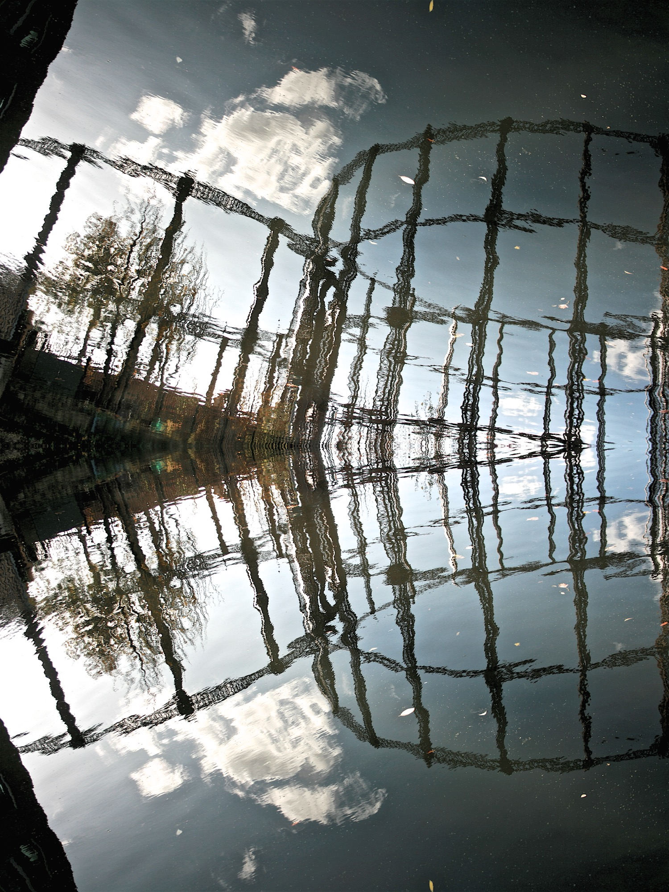

Reza Tavakol is an artist/writer/cosmologist. 

His art practice is concerned with the aesthetic and conceptual explorations of the real employing various art forms including photography.

**Email:** r.tavakol@qmul.ac.uk

## Sabrina Merolla

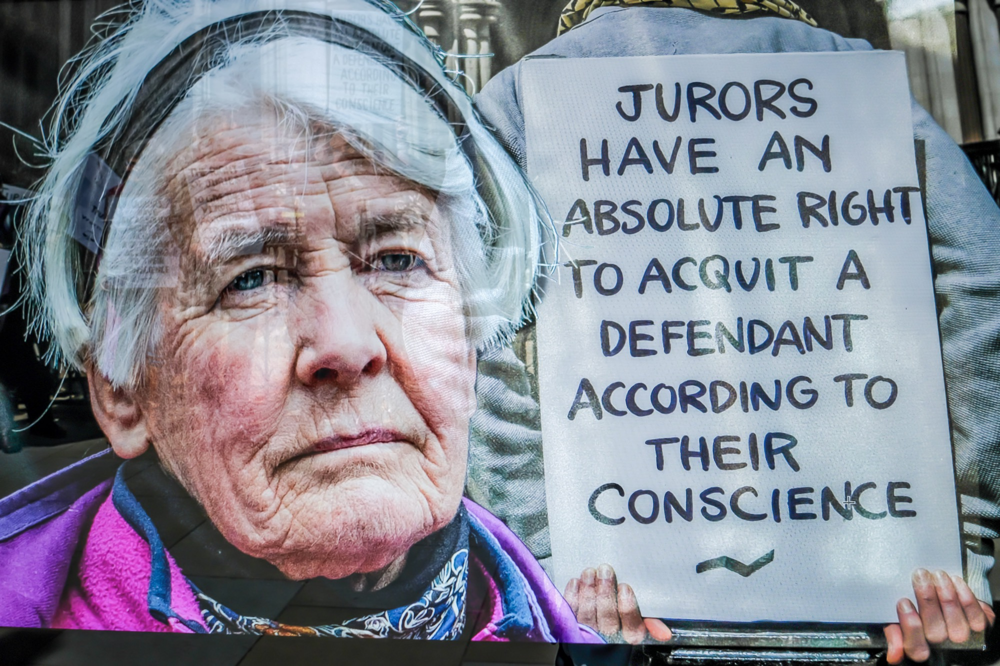

Sabrina Merolla is a press and documentary photographer, participatory art facilitator and mixed media artist. Her work focuses on the multiple displacements and identities of the contemporary world from the perspective of human and nature rights. She publishes in international media outlets, has won international photo awards and exhibited in China, Italy, 

**Website:** www.sabrinamerolla.co.uk 
**Instagram:** @sabrinamero

## Richard Earney

Richard is an abstract landscape photographer and a Fellow of the Royal Photographic Society.

His work primarily unfolds in series rather than standalone images, exploring the interplay of time, motion, colour, and light within the still image.

**Website:** method.photo 
**Instagram:** @methodphoto

## Sandra Roberts

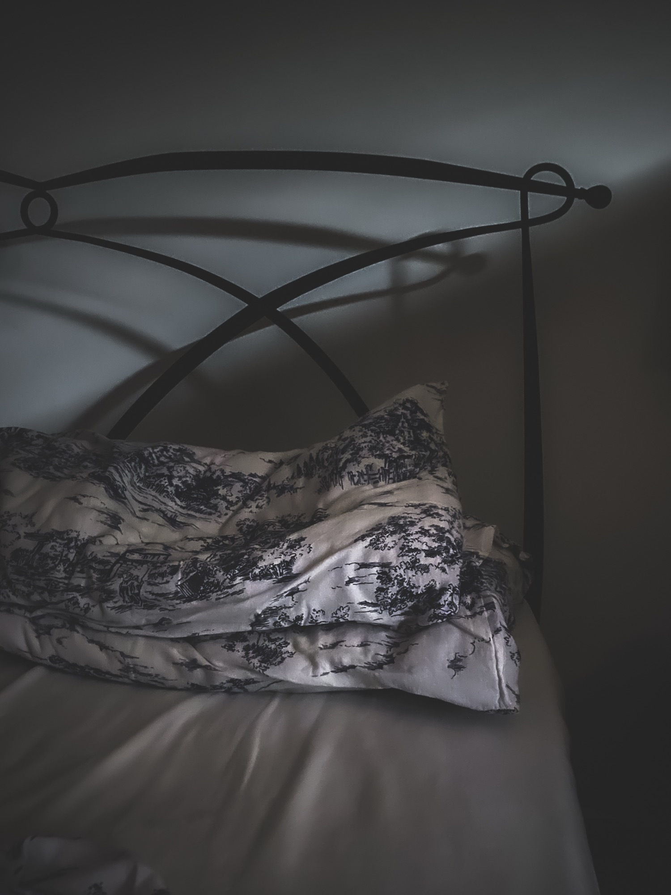

Sandra Roberts photographs span the divide between rural and urban locations where she aims to discover and document the influence of people, their individual stories, and how history can create a sense of place. She is interested in how photography can capture memories and retrieve the past, from the environments of the present.

**Website:** www.sandraroberts.myportfolio.com 
**Glass:** @sandrarobertsphotography
**Instagram:** @sandrarobertsphotography

## Sonia Davda

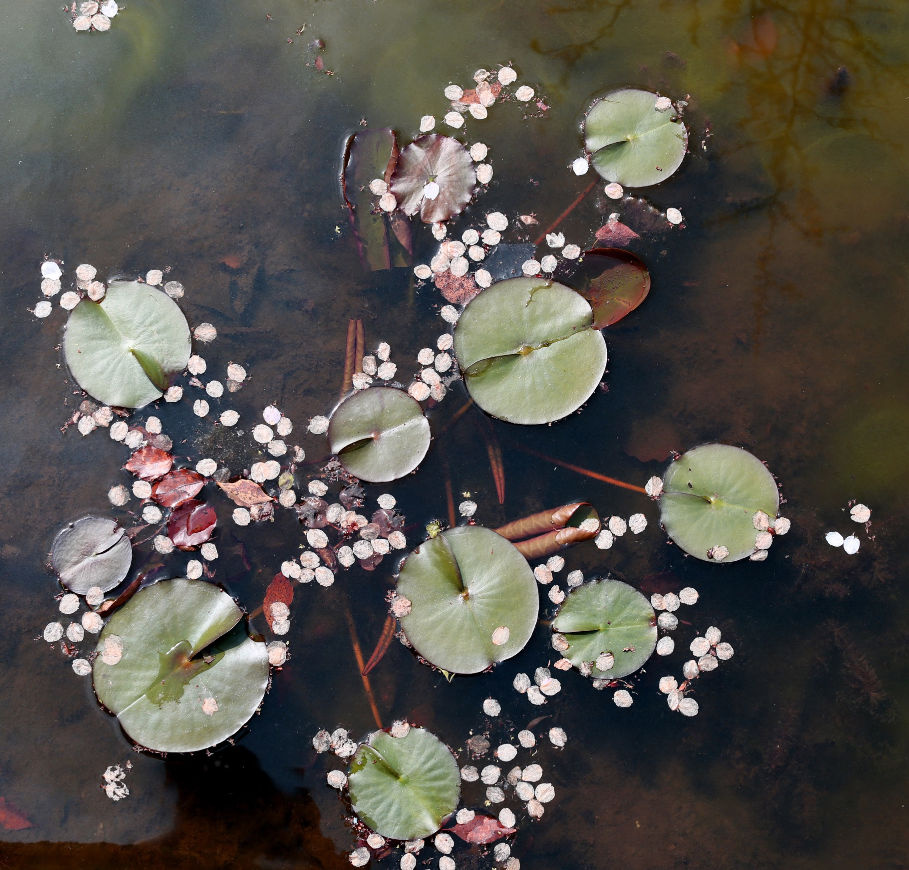

Sonia Davda undertook a BA (Hons) in Photography at the University of Brighton. She
has worked as a photojournalist for numerous publications including The Guardian, The
Times Education Supplement and the BBC.

Her specialism is in portraiture and documentary and tells stories of places and people
through her work.

**Email:** discosonia@hotmail.com 
**Instagram:** @soniadavda

## Robin Barr

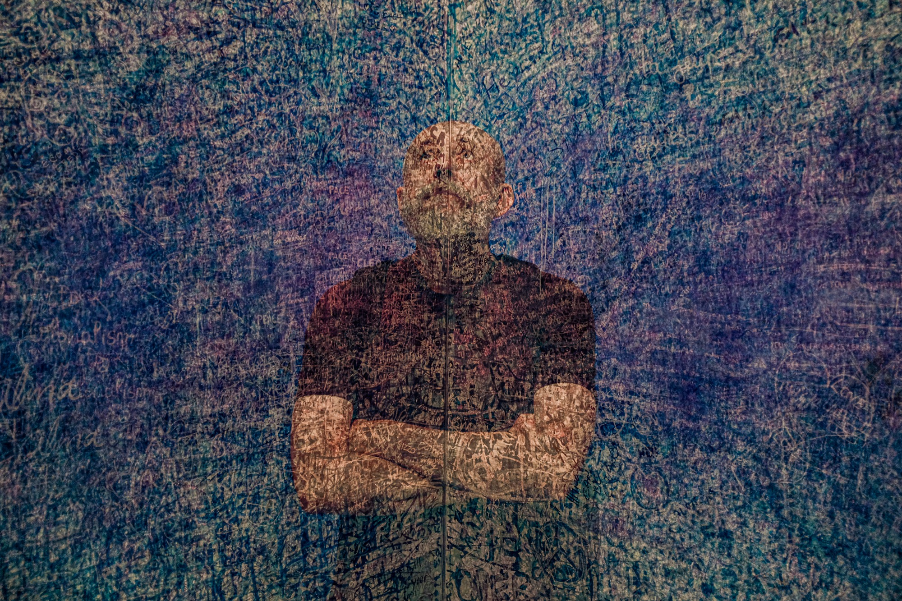

Robin creates abstract images inspired by patterns, shapes, lines, colours, and textures. He also enjoys creating in-camera multiple exposure images that require the viewer to take a longer look at the details captured. He has exhibited in multiple shows, including in Glasgow, Bradford, London, Halifax, and Hebden Bridge.

**Email:** nogreathurry@gmail.com

**Instagram:** @nogreathurry 
**Instagram:** @nogreathurry_people 
**Instagram:** @robin.likes.abstracts 
**Instagram:** @robin_maurice_barr

## Sonia Hunt

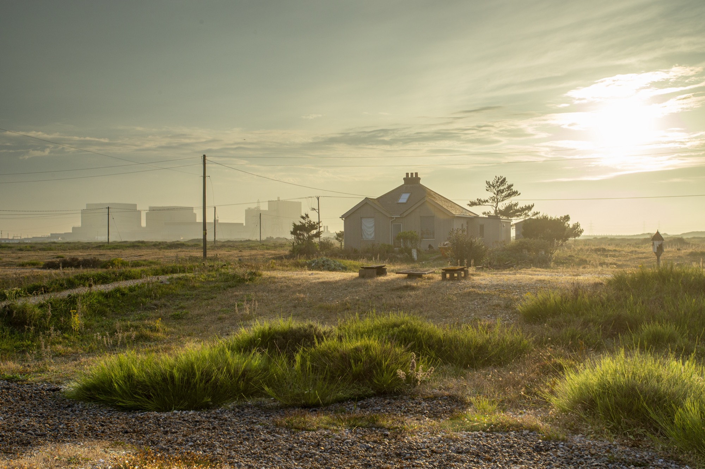

I fell in love with photography many years ago and completed a BvTEC in darkroom practices at the London School of Communication and a HNC at Westminster College. I am also a member of London Independent Photography (LIP) and f4 Photography.
 
I have worked in all areas of photography but in recent years I have concentrated predominantly on landscapes and seascapes which I have exhibited in Brighton and London. I also supply professional stock garden imagery.

**Email:** soniahunt57@gmail.com 
**Instagram:** @soniahunt57

## Kasia Kowalska

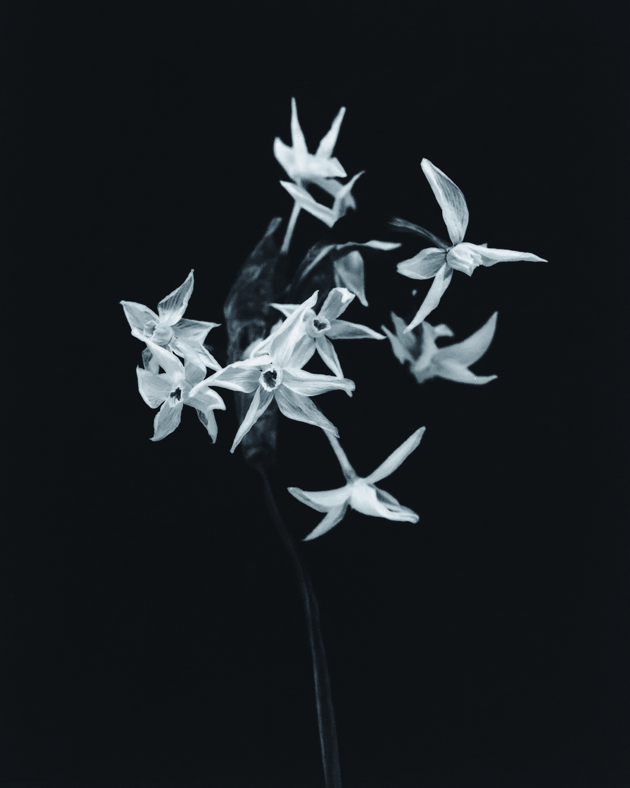

Kasia Kowalska is a Polish artist living in London. Her work involves digital and analogue photography. In her recent practice she reflects on a subjective experience relating to the female figure, feminist art theory, gender performativity, photographic archives, and our personal and collective relationship with the natural world. She has a BA degree in Photography from London Metropolitan University. She is a British Journal of Photography’s Portrait of Britain winner and Association of Photographers Student Awards winner and multiple finalist. She is the current editor of fLIP magazine.

**Instagram:**	@kasia_kowalska_photography

## Don Holtum

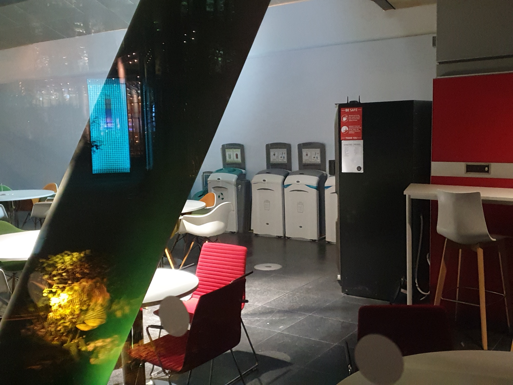

Don Holtum comes from a science and business background and his photographic interests derive from the appearance and nature of things around him.

Working in both analogue black and white and digital colour, and ignoring (or being ignorant of) the conventions of “the language of photography” and its ideological commitments, he seeks to produce pictures which are dynamic and context rich, with a resonance reflecting the realities and complexities of our surroundings.

**Email:** donholtum@gmail.com

## Mal Woodford and Charlotte Woolford

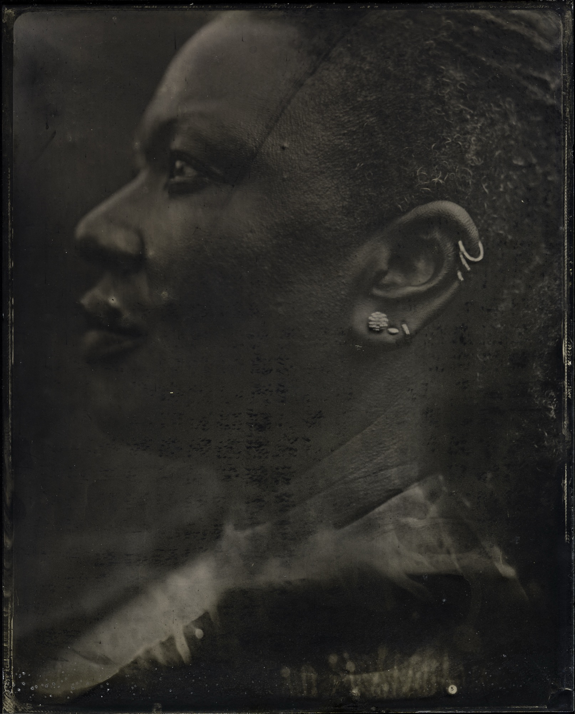

## Paul Plummer

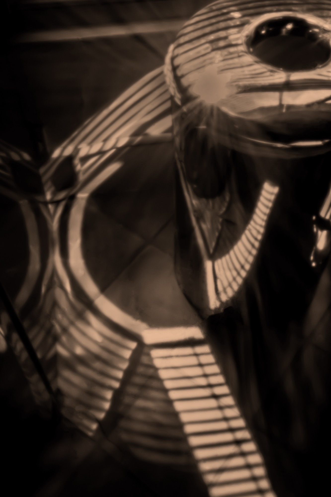

Paul works mainly with digital, and sometimes with analogue cameras. He's interested in alternative approaches, particularly pinhole photography. His bent is towards the abstract. He is fascinated by what it means to say a photograph is 'interesting' or 'worthwhile', and would like to extend the range of photography, often by considering subjects that are regularly overlooked.

