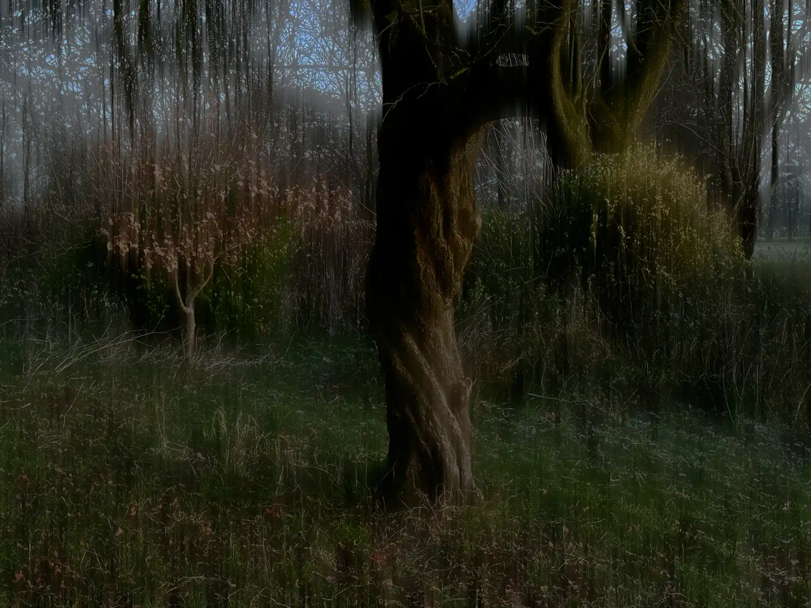
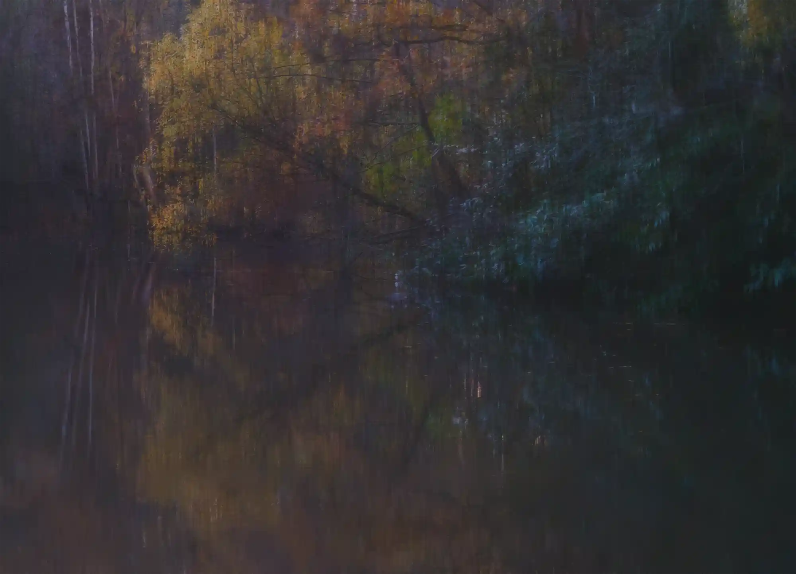

# {{page.title}}

### {{page.year}}

> The light fades, but the colour remains. 
> The unsettling sense of the eerie is all around.. 
> Now you’re In the Shudder Light

I'll be exhibiting some images from my current series In The Shudder Light at The Original Gallery First floor Hornsey Library London N8 9JA from 19–28 March 2024.

**Opening Hours:** 
Monday–Friday 13:00–19:00 
Saturday: 13:00–17:00 
Sunday: 12:00–16:00 
Thursday 28th: 13:00–17:00

**Private View (all welcome):** 19th March 18:00–20:30

**Meet the Artists:** 24th March 14:00–16:00

