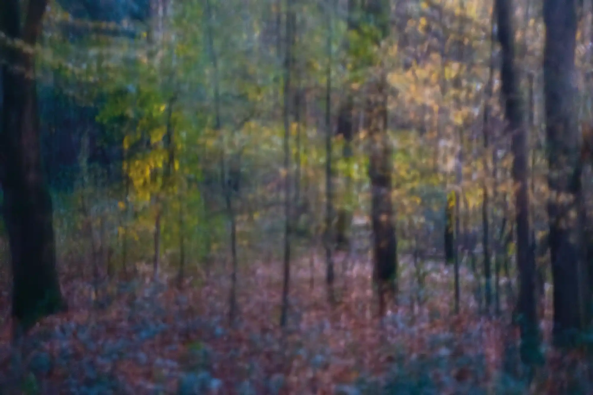

# {{page.title}}

### {{page.year}}

> The light fades, but the colour remains. 
> The unsettling sense of the eerie is all around.. 
> Now you’re In the Shudder Light

I exhibited some images from my series In The Shudder Light at The Original Gallery, London N8 9JA in 19–28 March 2024.

  

<strong>In The Shudder Light</strong> 
An A2 photographic print on Hahnemühle PhotoRag 308, stamped and signed on the reverse. £100
  

<a href="https://buy.stripe.com/fZe3cQbAQaj91e87sO" class="buybutton">
	  
</a>

  

<strong>In The Shudder Light</strong> 
An A2 photographic print on Hahnemühle PhotoRag 308, stamped and signed on the reverse. £100
  

<a href="https://buy.stripe.com/bIY5kY34k0Iz1e8aF1" class="buybutton">
	  
</a>

  

<strong>In The Shudder Light</strong> 
An A2 photographic print on Hahnemühle PhotoRag 308, stamped and signed on the reverse. £100
  

<a href="https://buy.stripe.com/00g28MeN2gHx3mgbJ6" class="buybutton">
	  
</a>

  

<strong>In The Shudder Light</strong> 
An A2 photographic print on Hahnemühle PhotoRag 308, stamped and signed on the reverse. £100
  

<a href="https://buy.stripe.com/8wM14IcEUbndbSM00p" class="buybutton">
	  
</a>

