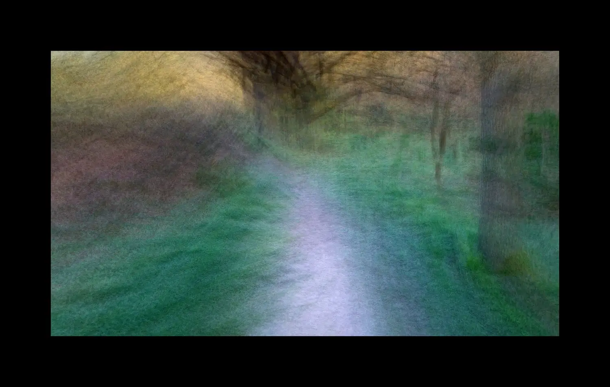
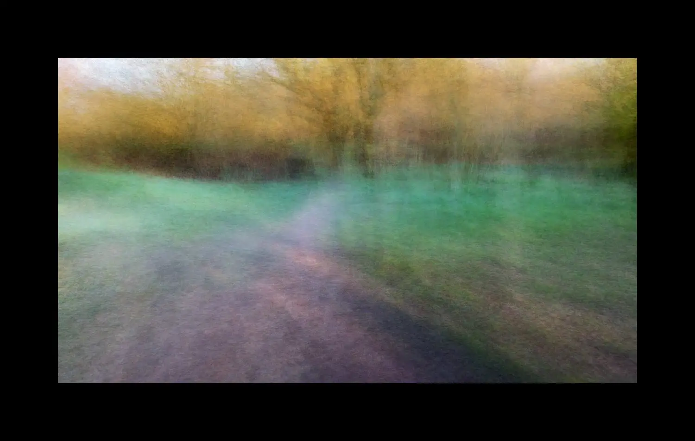
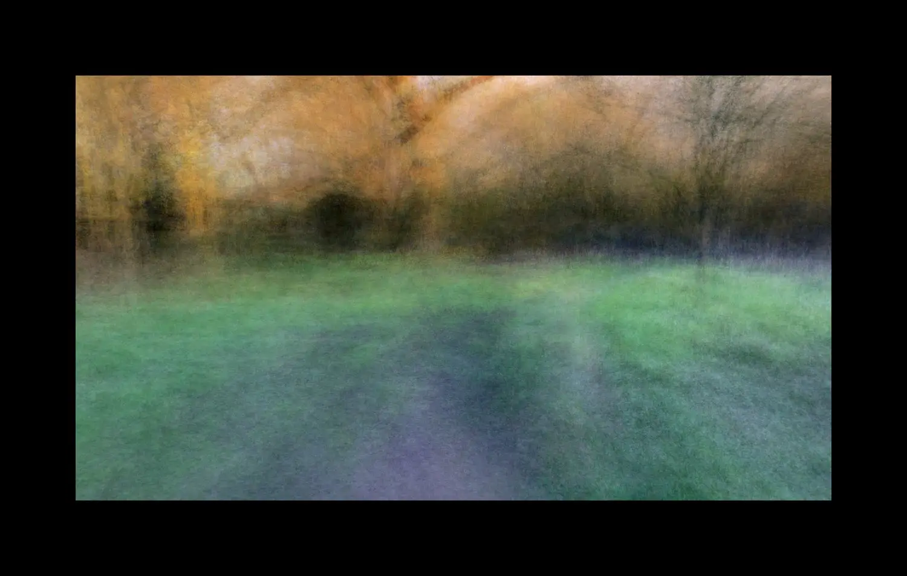
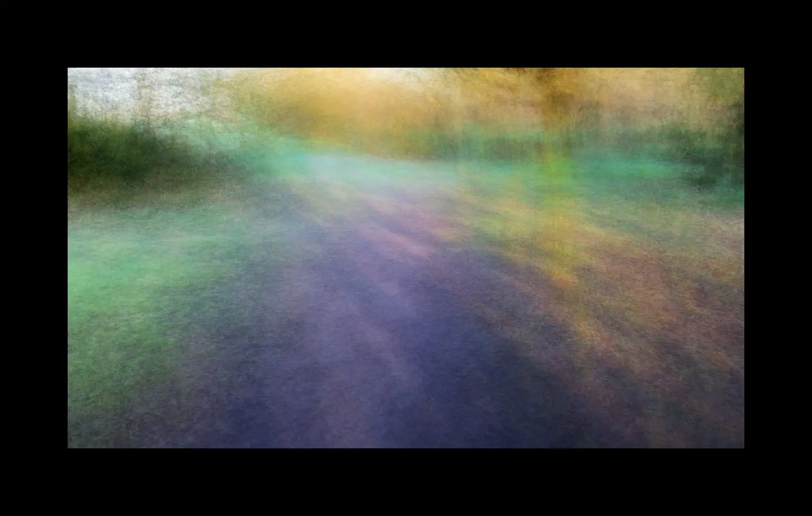

# {{page.title}}

Lockdown was a terrible period for so many. I took much solace in the daily permitted walks which strengthened my connection to nature. 

With many of my recent projects I’ve been experimenting with ways to depict the experience of walking in nature. You don’t just walk in a straight line, you walk and you turn, you walk and you stop, you walk and your eyes are flitting from left to right, up to down.

These images are collected here in a Motion Stills section.

