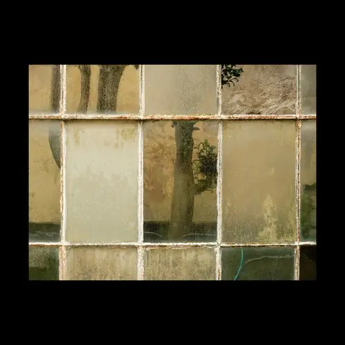
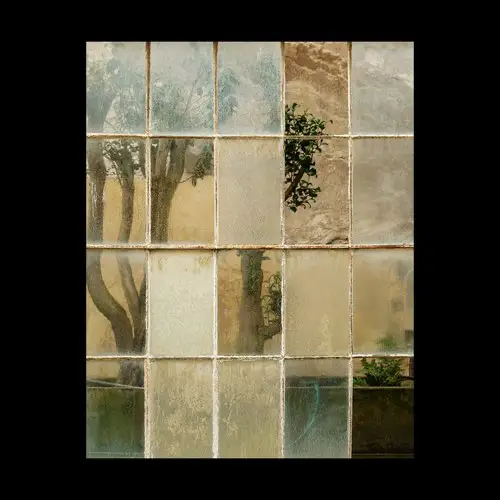
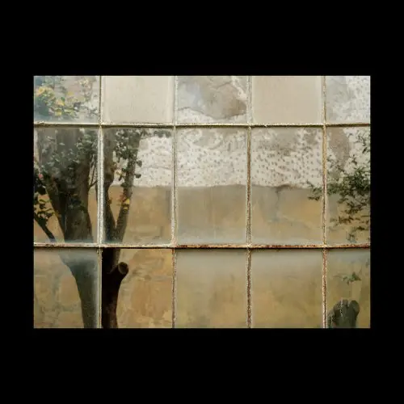
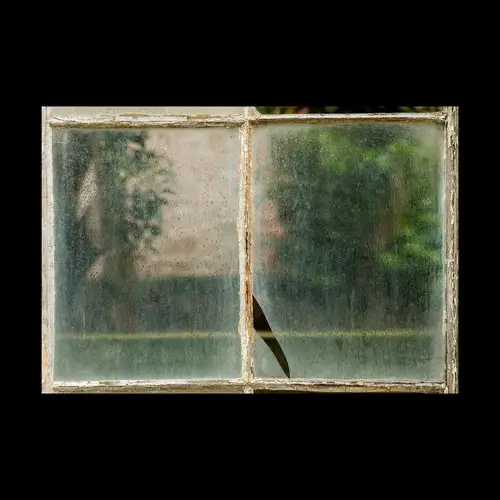
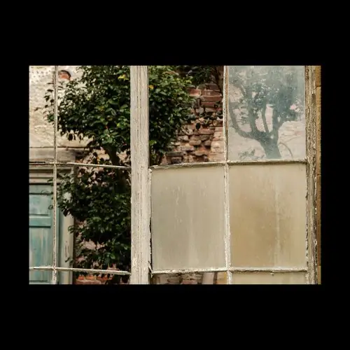
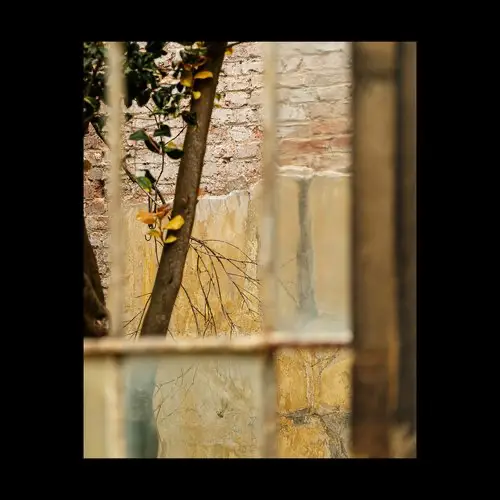

# {{page.title}}

### {{page.year}}

 “There are things known and there are things unknown, and in between are the doors of perception.” 
— Aldous Huxley

This series was made at a rather amazing stately home in Yorkshire called Wentworth Woodhouse. While wandering the grounds I came across the dilapidated Camellia House. It was obvious that it would make a great subject; the windows, the broken nature of it, and the grids were all perfectly imperfect.

