# {{page.title}}

### {{page.year}}

> “There are things known and there are things unknown, and in between are the doors of perception.” 
— *Aldous Huxley*

This series was made at a rather amazing stately home in Yorkshire called Wentworth Woodhouse. While wandering the grounds I came across the dilapidated Camellia House. It was obvious that it would make a great subject; the windows, the broken nature of it, and the grids were all perfectly imperfect.

In early 2024, the Camelia House was [reopened as a tea room](https://www.theguardian.com/culture/2024/mar/23/camellia-house-wentworth-woodhouse-teahouse-restored), so these images are a historic record of what the building looked like in 2020.

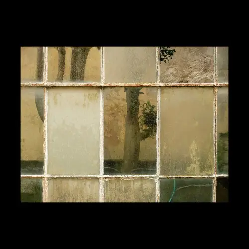

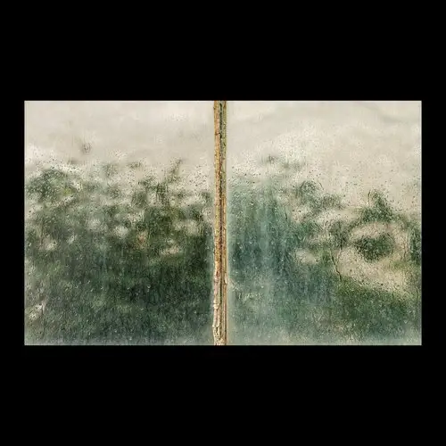

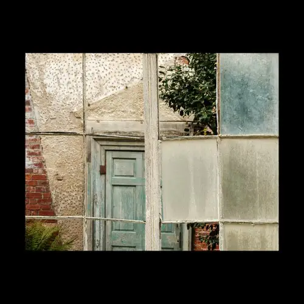

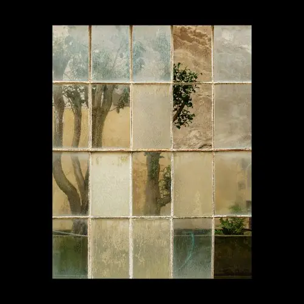

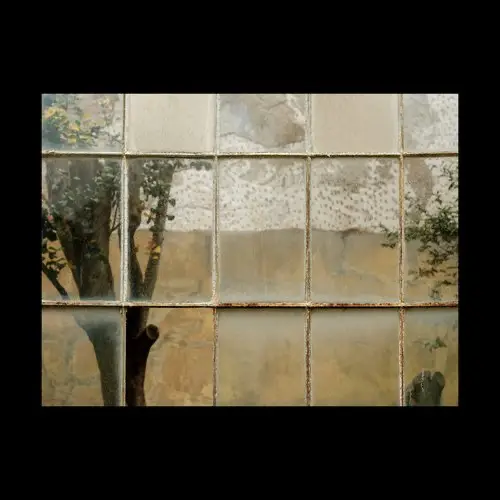

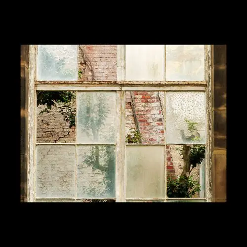

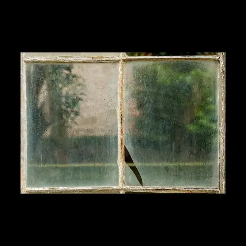

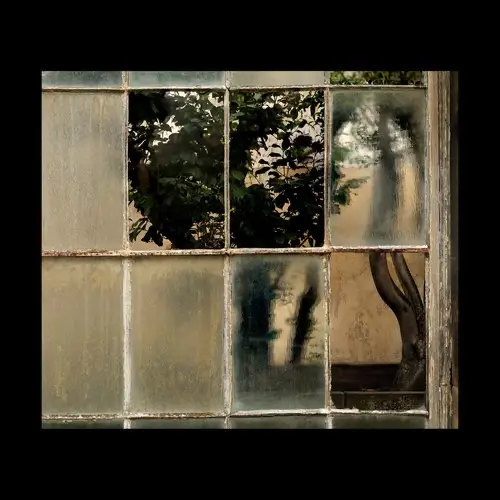

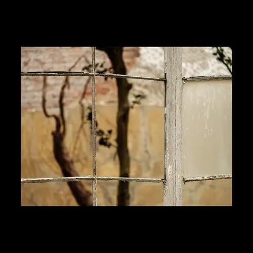

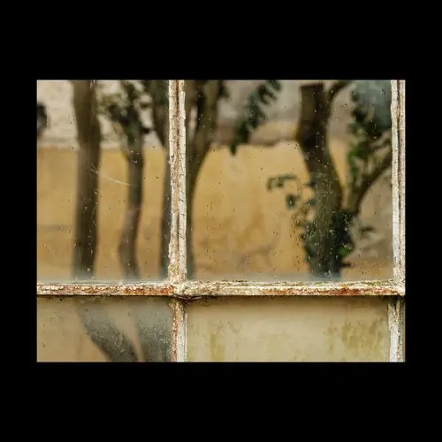

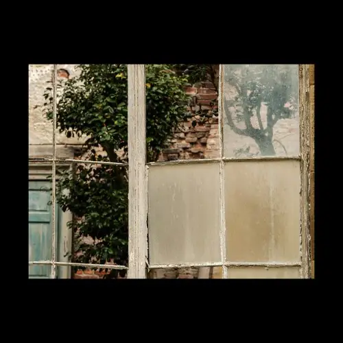

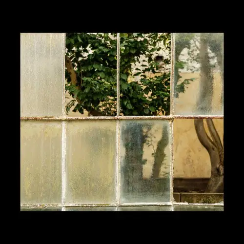

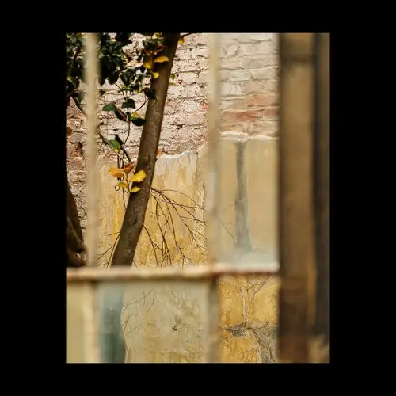

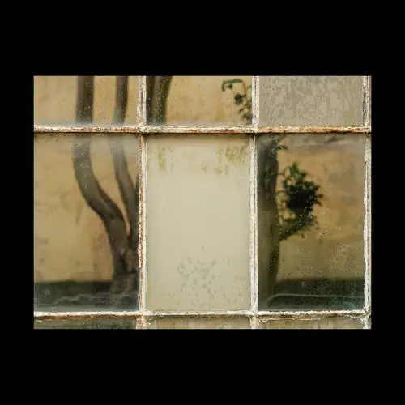

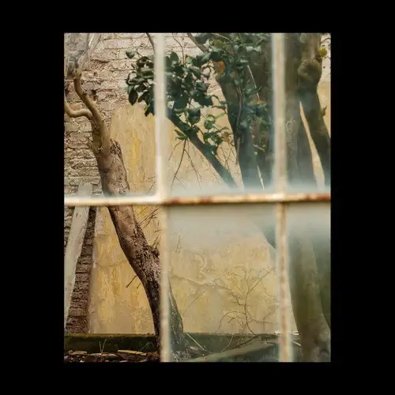

