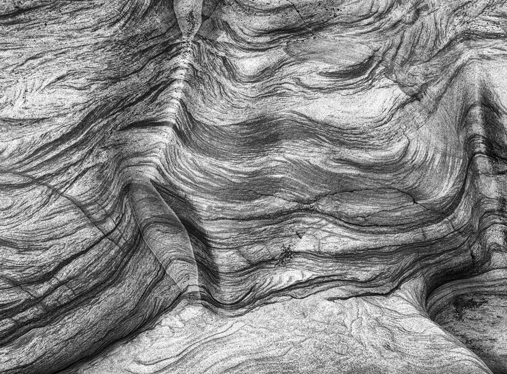
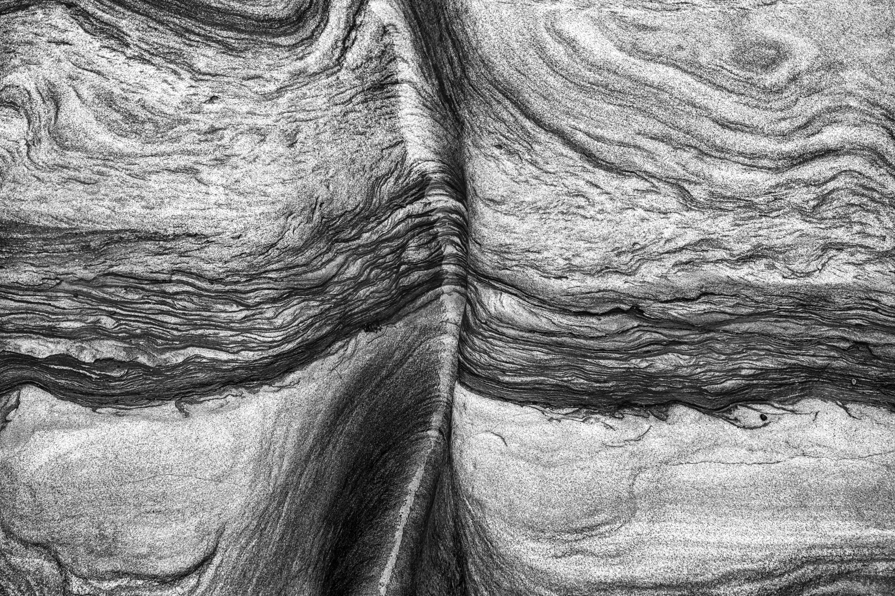
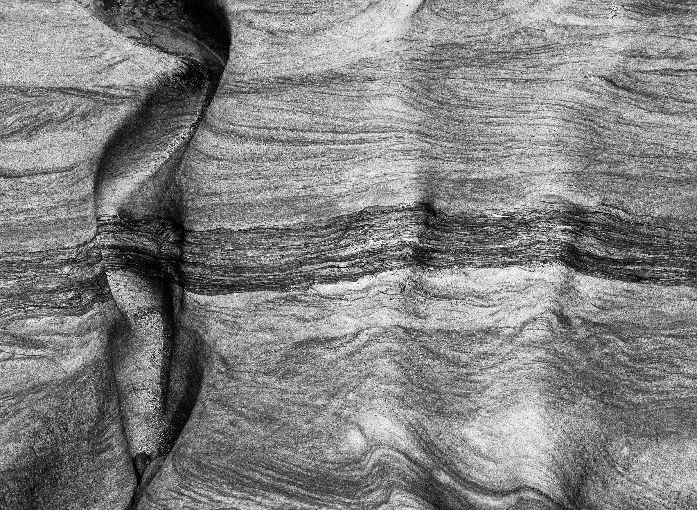
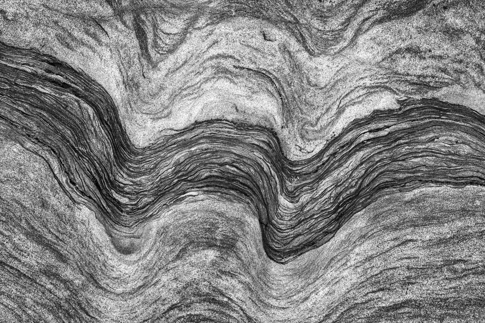

# {{page.title}}

### {{page.year}}

Sandstone rock formations on Spittal Beach. Millions of years of pressure in a single image. These have been remade in black and white from the [original series](../the-pressure-wave/).

