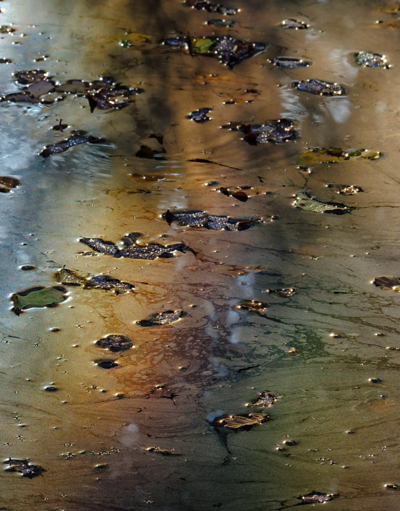
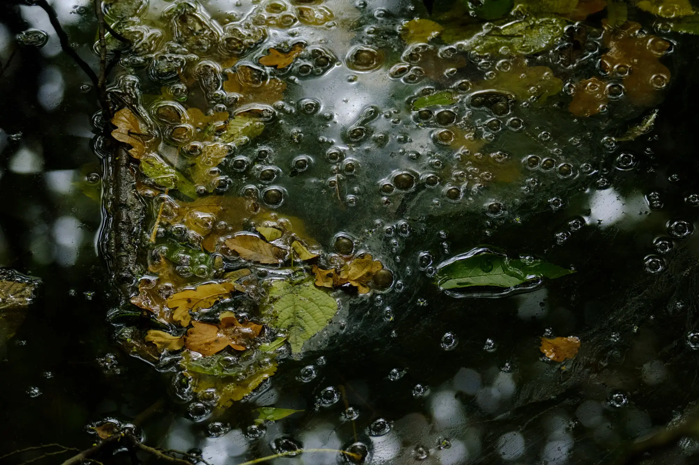
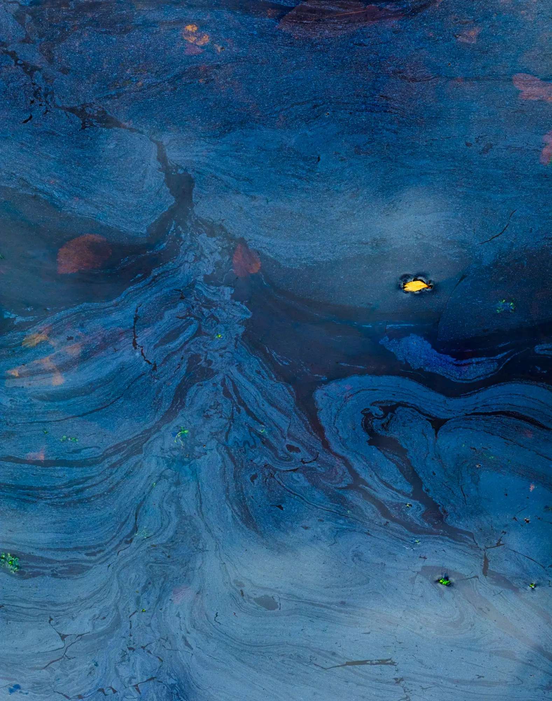
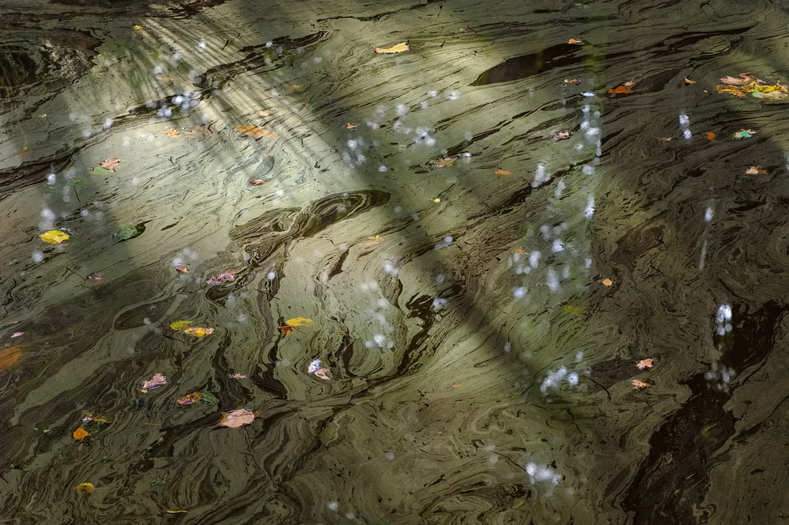
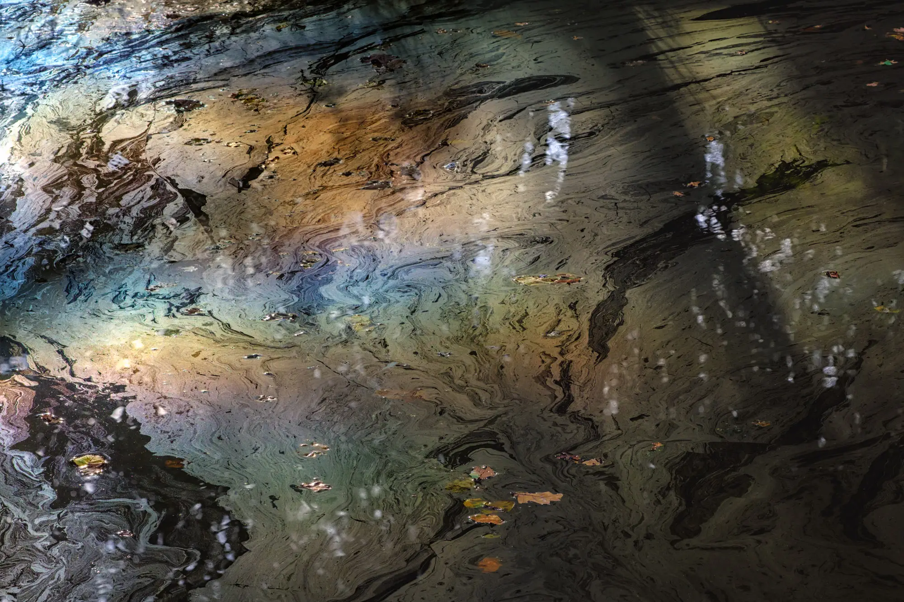
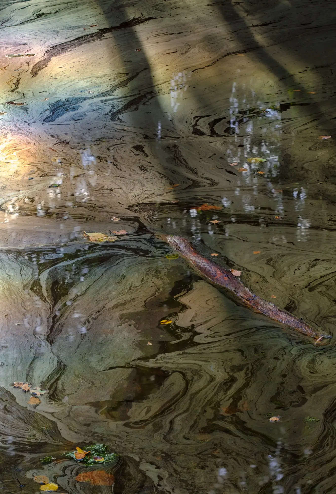

# {{page.title}}

### {{page.year}}

A simple pond in the place I most visit for walking and photography.

This pond is slightly isolated, with overhanging trees which give it an eerie feel. The harsh sound of rooks soundtracks my photography there. The people who pass tend not to understand why I’m interested in this pond, “it’s not very photogenic is it?”

Of course not; but yet it is…

The book [The Prismatic Pond](../books/the-prismatic-pond) is available to buy.

