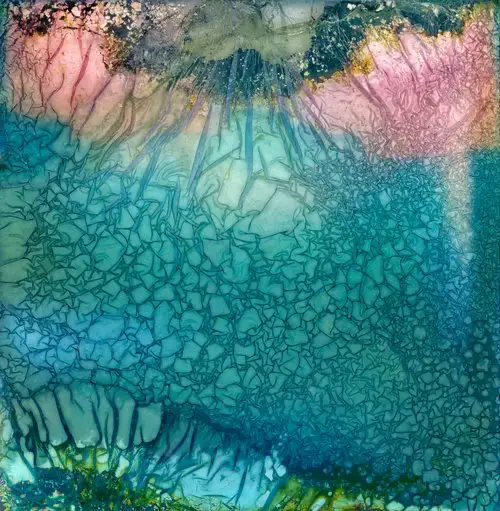
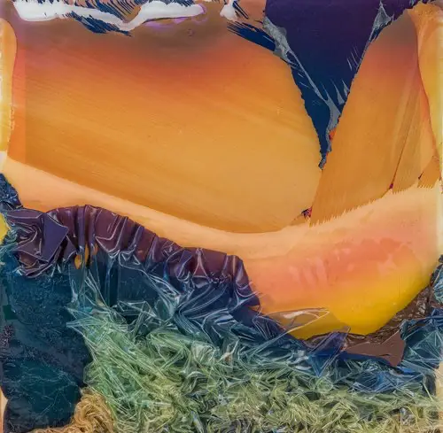

# {{page.title}}

### {{page.year}}

The Warped Topographies series began over eight years ago with a faulty film eject from my Polaroid SX-70 camera. At the time without knowing a huge amount about Polaroids, the way they worked (or sometimes didn’t), their cultural significance and their contribution to photographic history, I simply admired the abstract blobs that appeared from the camera.  What emerged was something otherworldly, but beautiful. I put it away – but every so often it reappeared, and I still liked it but I couldn’t see anything more in this image.

In 2016, I returned to image making with my now newly repaired Polaroid camera. Learning from the experience of the previous ‘faulty’ eject along with research in how to distress Polaroids, I began to manipulate the films as they ejected from the camera – first by hand, later using tools, heat, fire, and various liquids.

The images which emerged from these processes became more and more abstracted. To me they resembled aerial satellite imagery, with tortured landforms, disrupted river flows, impenetrable forests, glacial melts and ice flows all ‘appearing’ in these fractured works. 

As the project picked up momentum, I came across the work of abstract landscape photographers such as [David Maisel](https://davidmaisel.com/works/terminal-mirage/) and [Edward Burtynsky](https://www.edwardburtynsky.com/projects/photographs/water), who depict man’s impact on the environment. I also took inspiration from [Paul Kenny’s fabulous Seaworks](https://paul-kenny.co.uk) lifetime project. 
Their work reinforced my conceit that these small-scale works were hand-made imagined landscapes from this and other worlds.

Here are a mere 13 images of the approximately 1000 made, so far.


