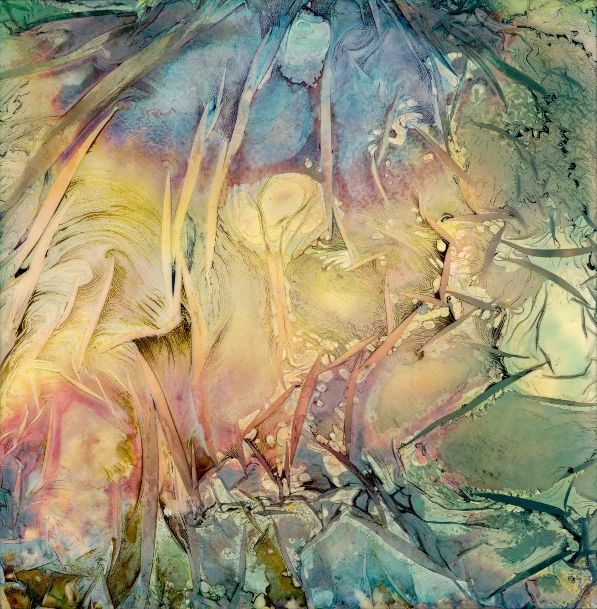
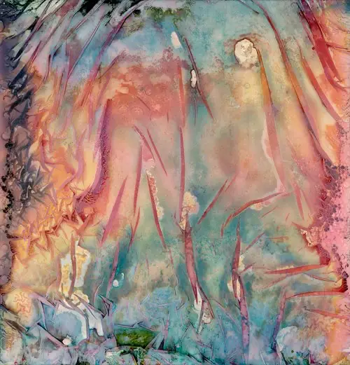
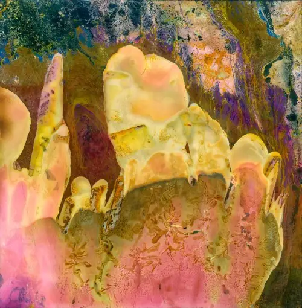

# {{page.title}}

### {{page.year}}

Warped Topographies began in 2012 with a faulty film eject from my Polaroid SX-70 camera.
At the time, without knowing a huge amount about Polaroid, the way the films worked (or sometimes didn’t), their cultural significance, and their contribution to photographic history, I put it aside. 

The image that had emerged was something otherworldly, but beautiful. 
Every so often it reappeared during a tidy up,  I loved what I saw but was there more to it?

In 2016, I returned to making images with my newly repaired Polaroid camera. 
With my previous experience of the ‘faulty’ eject, and after much research, I attempted to manipulate the films as they ejected from the camera to emulate the previous effect.

With advice and a bon chance from []@florintintin](https://instagram.com/florintintin) on Instagram, I  further warped the Polaroids, first by hand, later using tools, heat, fire, and various liquids. The images which emerged from these processes became more and more abstracted.

To me they resembled aerial satellite imagery, with tortured landforms, disrupted river flows, impenetrable forests, glacial melts and ice flows; all appeared in these twisted, fractured works.

As the project picked up momentum, I came across the work of abstract landscape photographers such as [David Maisel](https://davidmaisel.com/works/terminal-mirage/) and [Edward Burtynsky](https://www.edwardburtynsky.com/projects/photographs/waterr), who both depict man’s impact on the environment. I also took inspiration from [Paul Kenny’s fabulous Seaworks](https://paul-kenny.co.uk) lifetime project. 

Their work reinforced my conceit that my small-scale works were hand-made imagined landscapes from this and other worlds.

Here are a mere 13 images of the approximately 1000 made, so far.


